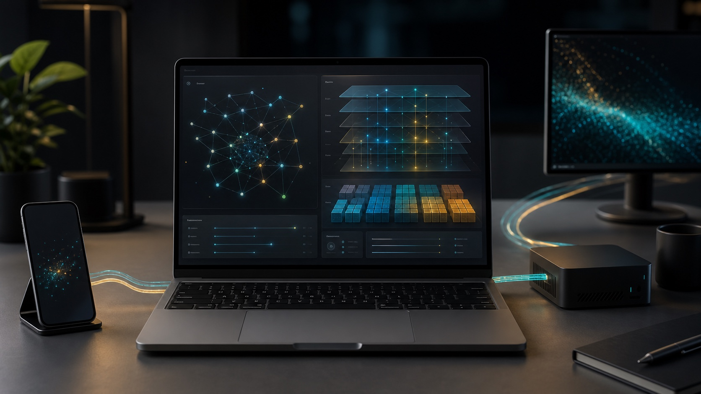
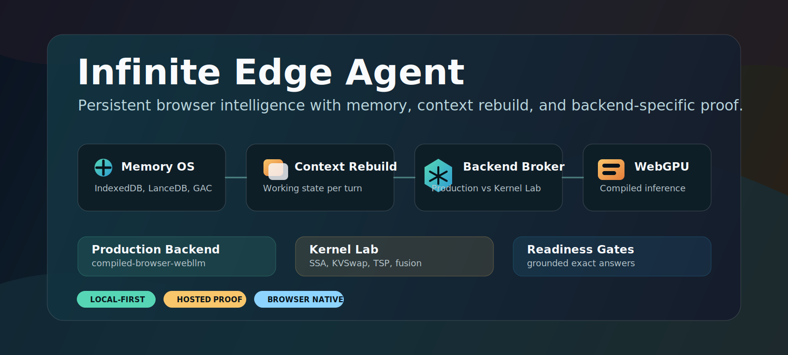
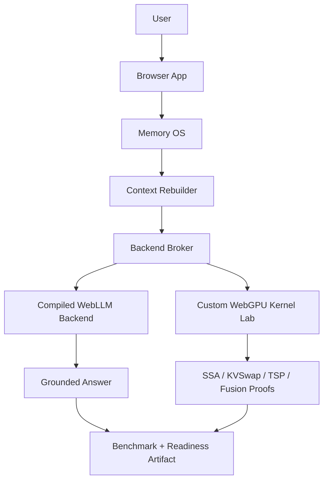

# Infinite Edge Agent

> Browser-native persistent AI agent runtime with local memory, context reconstruction, compiled WebGPU inference, and a custom WebGPU Kernel Lab.

<p align="center">
  
</p>

<p align="center">
  <a href="https://github.com/son-of-ole/infinite-edge-agent/actions/workflows/ci.yml"></a>
  
  
  
</p>

## What It Is

Infinite Edge Agent is a local-first AI agent runtime for the browser. It keeps memory, context rebuild, backend selection, model execution, and production readiness as separate subsystems instead of treating the LLM as the whole product.

The v12 architecture has two answer lanes:

| Lane | Role | Current status |
|---|---|---|
| `compiled-browser-webllm` | Production candidate using WebLLM/MLC compiled browser inference | Passing grounded hosted/browser proof |
| `unlocked-browser-transformer` | Custom WebGPU Kernel Lab for SSA, KVSwap, TSP, top-k, residency, and fusion research | Useful for research gates, not the default deploy claim |

The practical goal is simple: give a browser-hosted agent persistent memory and grounded answers while keeping the execution path honest about which backend is actually production-ready.

## Why It Is Different

Most browser AI demos are one of these:

- a chat UI around a remote API,
- a local model demo with little memory/runtime structure,
- or a benchmark/kernel experiment with no product-level readiness gate.

Infinite Edge Agent combines the pieces:

- **Memory OS**: browser IndexedDB memory by default, optional LanceDB sidecar, import/export, redaction, and retrieval traces.
- **Context Runtime**: rebuilds active working context before each turn from retrieved memory, session state, pinned facts, and constraints.
- **Backend Broker**: chooses backend by role instead of pretending all backends are equally deployable.
- **Compiled production backend**: WebLLM/MLC compiled browser model path for real hosted answers.
- **Kernel Lab**: custom WebGPU Qwen runtime for SSA, KVSwap, MTP lab work, sparse attention, and fusion experiments.
- **Production gates**: exact-answer checks, grounded-memory checks, backend-specific readiness, speed floor, and fallback reporting.

## Current Hosted Proof

The hosted Replit build has been manually tested across multiple real devices:

| Platform | GPU class | Result |
|---|---|---|
| macOS / Chrome | Apple GPU | Fast, grounded answer path passed |
| Windows / Chrome or Edge | Discrete GPU | Fast, grounded answer path passed |
| Windows / Chrome or Edge | Intel integrated GPU | Slower, still functional |
| iPhone 17 | Mobile GPU | Quick and usable |

The latest local production proof artifact for the compiled backend reported:

```json
{
  "runtimeBackendId": "compiled-browser-webllm",
  "productionDeployReadyPassed": true,
  "compiledBackendReadyPassed": true,
  "memoryGroundingPassed": true,
  "expectedExactPassed": true,
  "productionSpeedFloorPassed": true,
  "response": "Helena"
}
```

See [Hosted Device Proof](docs/56_HOSTED_DEVICE_PROOF.md) for the device matrix and [Benchmark Telemetry](docs/57_BENCHMARK_TELEMETRY.md) for the opt-in database-backed benchmark collector.

## Quick Start

```bash
pnpm install
pnpm dev:web
```

Open the Vite URL in Chrome or Edge.

For the compiled production-candidate lane:

```bash
VITE_COMPILED_WEBLLM_ENABLED=true
VITE_LLM_BACKEND=compiled-browser-webllm
VITE_DEFAULT_MODEL=Qwen3-0.6B-q4f16_1-MLC
VITE_MEMORY_PROVIDER=browser-vector
pnpm dev:web
```

For the custom WebGPU Kernel Lab lane:

```bash
VITE_LLM_BACKEND=unlocked-browser-transformer
VITE_DEFAULT_MODEL=Qwen/Qwen3-0.6B
VITE_REQUIRE_UNLOCKED_RUNTIME=true
VITE_UNLOCKED_ALLOW_FIXTURE=true
VITE_MEMORY_PROVIDER=browser-vector
pnpm dev:web
```

Production deployments should keep model weights and private memory outside Git. Local Qwen conversion and full unlocked runtime proof remain available for research, but the default deploy story is the compiled backend.

## Browser Benchmark Route

The browser app exposes a proof route for real-device checks:

```text
/__bench/browser-runtime
```

Example compiled-backend proof URL:

```text
/__bench/browser-runtime?backend=compiled-browser-webllm&modelId=Qwen3-0.6B-q4f16_1-MLC&memoryGrounding=montana_capital&expectedExact=Helena&generationTokens=8&qwenThinkingMode=disabled
```

The benchmark records:

- backend id and model id,
- exact response checks,
- memory retrieval/context rebuild proof,
- generated-token timing,
- production-readiness summary,
- CPU/fallback indicators where available,
- and the raw JSON artifact.

Opt-in hosted telemetry can be enabled with `VITE_BENCHMARK_TELEMETRY_ENABLED=true`, `VITE_BENCHMARK_TELEMETRY_URL=/api/benchmark-runs`, and the optional memory-server collector `BENCHMARK_TELEMETRY_ENABLED=true`, then requested per run with `submitTelemetry=true`. Uploaded artifacts are sanitized in the browser and again at the server so raw prompts, raw responses, expected strings, and token diagnostics are not stored. The collector exposes `/api/benchmark-runs/dashboard` and `/api/benchmark-runs/export.csv` for reviewing hosted device results, supports `BENCHMARK_TELEMETRY_STORAGE=postgres` for durable hosted storage, rate-limits submissions, and can protect review/export routes with `BENCHMARK_TELEMETRY_ADMIN_TOKEN`. See [Benchmark Telemetry](docs/57_BENCHMARK_TELEMETRY.md).

## Main Commands

```bash
pnpm typecheck              # Type-check every workspace package
pnpm test                   # Run converter, core, web, memory-server, and SDK tests
pnpm build                  # Build packages and browser app
pnpm eval:production        # Run production eval harness
pnpm eval:backend-readiness # Write backend role/readiness matrix artifact
pnpm eval:shared-runtime    # Write shared memory/context runtime readiness artifact
pnpm eval:v12-readiness     # Write combined v12 final-state readiness artifact
pnpm eval:v12-suite         # Write the full hosted/backend/shared/v12 artifact set
pnpm bench:browser-runtime  # Run browser-runtime benchmark harness
pnpm verify:hosted-profile  # Check compiled-backend hosted deploy env + benchmark URL
pnpm verify:hosted-benchmark-proof # Validate a saved real browser benchmark artifact
pnpm smoke:sdk              # Validate embeddable browser SDK package
```

## Repository Layout

```text
apps/web                 Browser app, benchmark route, compiled backend adapter
apps/memory-server       Optional LanceDB-compatible memory sidecar
packages/core            Runtime contracts, SSA/KVSwap/TSP/Kernel Lab logic
packages/sdk             Embeddable browser launcher SDK
docs                     Architecture, proof gates, deployment notes, research specs
scripts                  Release gates, evals, model conversion, benchmarks
configs                  Example runtime and SSA configuration
prompts                  System and memory-rebuild prompts
```

## Architecture

<p align="center">
  
</p>



The important separation is:

```text
Agent != Model

Agent =
  runtime
  + memory system
  + context rebuilder
  + backend broker
  + readiness gates
  + model backend
```

## Production Readiness Policy

Production readiness is backend-specific.

The compiled backend can pass deploy readiness when:

- the hosted browser app loads over HTTPS,
- WebLLM initializes,
- grounded memory retrieval returns the expected fact,
- exact-output checks pass,
- the speed floor passes,
- and the artifact reports `productionDeployReadyPassed: true`.

The custom WebGPU Kernel Lab can pass research gates, but it does not automatically count as the deployed production answer backend. This keeps speed/kernel research from blurring product readiness.

## Memory

The default memory provider is browser-local IndexedDB. Nothing is sent to a hosted memory service unless you configure a remote endpoint.

Supported memory modes:

- `browser-vector`: default local browser memory,
- `remote-http`: authenticated remote memory API,
- optional local LanceDB sidecar for development and larger local recall.

Memory features include deterministic search, import/export, context-pack traces, redaction of common secret-shaped values, and benchmarkable retrieval canaries.

## Deployment

The app can be hosted anywhere that serves a modern HTTPS web app with the right headers. Replit has already been used for hosted proof. Vercel configuration is included in [vercel.json](vercel.json).

Recommended production env:

```bash
VITE_COMPILED_WEBLLM_ENABLED=true
VITE_LLM_BACKEND=compiled-browser-webllm
VITE_DEFAULT_MODEL=Qwen3-0.6B-q4f16_1-MLC
VITE_MEMORY_PROVIDER=browser-vector
VITE_QWEN_THINKING_MODE=disabled
VITE_MTP_ENABLED=false
```

For hosted deployments that collect cross-device benchmark results, also configure durable telemetry and verify the profile before making a deploy-ready claim:

```bash
VITE_BENCHMARK_TELEMETRY_ENABLED=true
VITE_BENCHMARK_TELEMETRY_URL=/api/benchmark-runs
BENCHMARK_TELEMETRY_ENABLED=true
BENCHMARK_TELEMETRY_STORAGE=postgres
BENCHMARK_TELEMETRY_DATABASE_URL=<postgres-connection-string>
BENCHMARK_TELEMETRY_ADMIN_TOKEN=<dashboard-export-token>
HOSTED_PRODUCTION_BENCHMARK_URL='https://agent.example.com/__bench/browser-runtime?backend=compiled-browser-webllm&modelId=Qwen3-0.6B-q4f16_1-MLC&memoryGrounding=montana_capital&expectedExact=Helena&submitTelemetry=true&qwenThinkingMode=disabled'
pnpm verify:hosted-profile
```

The verifier writes `.artifacts/evals/hosted-deployment-profile-latest.json`. Set `RELEASE_REQUIRE_HOSTED_PROFILE=true` to make `pnpm release:gate` run the hosted profile verifier and include that artifact in its release summary.

`pnpm eval:backend-readiness` writes `.artifacts/evals/backend-readiness-matrix-latest.json`, separating the deploy-ready compiled backend from the research-only Kernel Lab backend. `RELEASE_REQUIRE_HOSTED_PROFILE=true` automatically includes this matrix in the release gate; `RELEASE_REQUIRE_BACKEND_READINESS_MATRIX=true` can require it independently.

`pnpm eval:shared-runtime` writes `.artifacts/evals/shared-runtime-readiness-latest.json`, proving that memory search, context rebuild, context-pack trace persistence, runtime trace persistence, and backend profile routing sit above the model backend boundary. `RELEASE_REQUIRE_HOSTED_PROFILE=true` includes this artifact automatically; `RELEASE_REQUIRE_SHARED_RUNTIME_READINESS=true` can require it independently.

`pnpm eval:v12-readiness` writes `.artifacts/evals/v12-readiness-bundle-latest.json`, combining hosted profile, backend matrix, and shared-runtime proof into one final-state artifact. Use `RELEASE_REQUIRE_V12_READINESS=true` to require that bundle independently.

`pnpm eval:v12-suite` writes the complete final-state artifact set with one timestamp: hosted profile, backend readiness matrix, shared runtime readiness, v12 readiness bundle, and `.artifacts/evals/v12-readiness-suite-latest.json`. Use `RELEASE_REQUIRE_V12_SUITE=true` to require the suite independently; `RELEASE_REQUIRE_HOSTED_PROFILE=true` also includes it.

After running the real hosted benchmark in Chrome or Edge, validate the saved browser artifact before making a backend-specific production claim:

```bash
HOSTED_BENCHMARK_ARTIFACT_PATH=.artifacts/evals/hosted/browser-runtime-bench-latest.json pnpm verify:hosted-benchmark-proof
```

The proof verifier rejects artifacts that are not `compiled-browser-webllm`, are technical-only, lack grounded memory, fail exact output, use direct model factual output as retrieval proof, miss the speed floor, or show CPU fallback.

For WebGPU and WASM performance, use a secure context and cross-origin isolation headers where your hosting platform supports them.

## Publication Path

This project is suitable for three public surfaces:

- **GitHub** for source, docs, issues, and releases.
- **Hugging Face Space** for a live browser demo.
- **Hugging Face Dataset** for anonymized benchmark artifacts and device/GPU performance matrices.

A systems-style technical report or preprint should position this as a browser-native persistent memory/runtime architecture, not a new base model. See [CITATION.cff](CITATION.cff) for citation metadata.

Suggested GitHub repository metadata is maintained in [Repository Metadata](docs/58_REPOSITORY_METADATA.md).

## Limitations

- Performance depends heavily on browser, GPU, driver, and device memory.
- First load can include model download and WebLLM initialization.
- WebGPU adapter details can be restricted by browser privacy policy.
- The custom Kernel Lab is intentionally not the default deploy claim.
- Private memory, user prompts, and benchmark telemetry need explicit privacy controls before public opt-in collection.

## Key Docs

- [Architecture](docs/01_ARCHITECTURE.md)
- [Build and Run](docs/02_BUILD_AND_RUN.md)
- [Current Codebase Architecture Trace](docs/55_CURRENT_CODEBASE_ARCHITECTURE_TRACE.md)
- [Hosted Device Proof](docs/56_HOSTED_DEVICE_PROOF.md)
- [Benchmark Telemetry Plan](docs/57_BENCHMARK_TELEMETRY.md)
- [Repository Metadata](docs/58_REPOSITORY_METADATA.md)
- [Open Source Release Checklist](docs/54_OPEN_SOURCE_RELEASE_CHECKLIST.md)
- [Unlocked Browser Runtime](docs/53_UNLOCKED_BROWSER_RUNTIME.md)

## License

MIT. Model weights, third-party models, papers, and external compiled artifacts may carry separate licenses. Verify those licenses before redistribution or commercial deployment.
