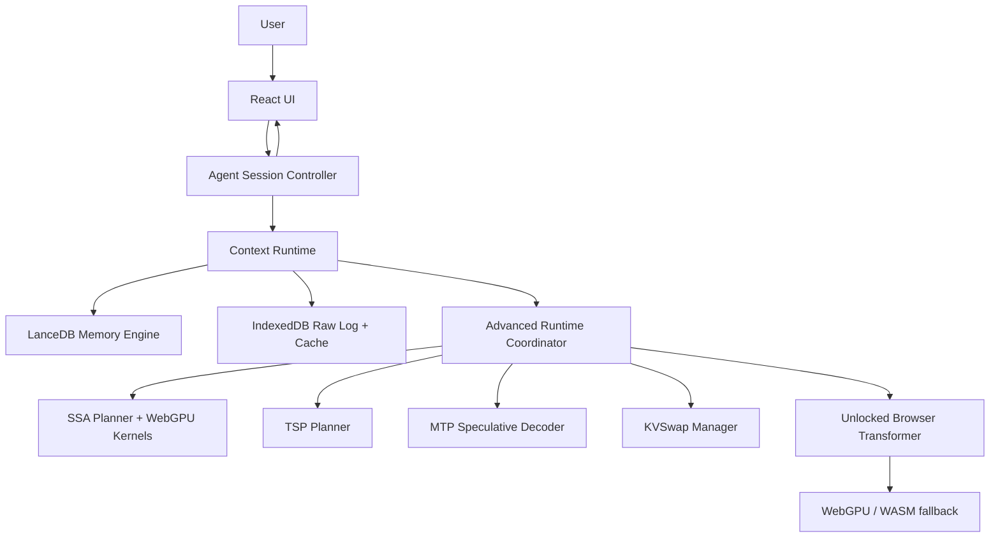

# Infinite Edge Agent

A local-first, edge/browser AI-agent architecture for persistent long-context work.

This repo converts the uploaded brief, **“Architecting Infinite-Context, Persistent AI Agents on Edge Devices,”** into a buildable system where the advanced runtime is included from the start rather than bolted on later. The core architecture treats these as Tier-0 subsystems:

- **Browser Vector Memory** — default IndexedDB-backed local vector store with deterministic search, metadata filters, import/export, and context-pack trace persistence.
- **LanceDB Memory Engine** — optional local vector/columnar sidecar for durable cross-session recall at larger scale.
- **Context Runtime** — rebuilds active working state from LanceDB, raw transcript, summaries, pinned anchors, and task state.
- **SSA Runtime** — SubQ-compatible subquadratic selective-attention target, with a public SSA implementation path and WebGPU kernel boundary.
- **TSP Runtime** — folded tensor/sequence parallel execution planner for memory-aware local inference backends.
- **MTP / Speculative Decoding Runtime** — draft/verify generation path for lower autoregressive latency.
- **KVSwap Runtime** — disk-aware KV-cache tiering, eviction, and prefetch contracts.

The scaffold still runs with fallbacks while custom kernels and model backends are being built. Fallbacks are compatibility layers, not the final product architecture.

The central architectural stance is that the model is not the whole agent. The model is the reasoning engine; the agent is the runtime plus memory, context rebuild, attention routing, cache management, consolidation, planning, and model execution. The Context Runtime reconstructs active working state before each inference cycle, and the Advanced Runtime Coordinator plans compute, memory, attention, cache residency, and decode strategy around that state.

## SSA target stance

SubQ.ai is the high-level product target: a fully subquadratic, sparse-attention long-context model class. Public SubQ implementation details and model weights are not currently enough to clone that system. Therefore this repo defines a **SubQ-compatible SSA target** and a public implementation path based on the open SSA work:

- block-level sparse routing,
- selected key/value blocks rather than dense all-to-all attention,
- pinned anchor/sink handling,
- dense-reference validation,
- bidirectional sparse/full alignment as the training reference,
- WebGPU kernels for block scoring, top-k block selection, KV gathering, and sparse attention.

## Practical target architecture



## What ships in this scaffold

```text
apps/web                 Browser UI, unlocked Qwen worker, memory client
apps/memory-server       Optional local LanceDB sidecar
packages/core            Shared runtime contracts and first-class subsystem scaffolding
packages/sdk             Embeddable browser SDK for any website
docs                     Architecture, kernel plans, runtime specs, validation gates
configs                  Example runtime and SSA configs
prompts                  System and memory rebuild prompts
scripts                  Smoke and benchmark utilities
```

## Current implementation status

### Implemented now

| Area | Status | Verification |
|---|---|---|
| Browser vector memory | Default `browser-vector` IndexedDB provider with deterministic search, import/export, and context-pack traces. No hosted memory endpoint is required. | `pnpm eval:production`, browser smoke |
| Remote-compatible memory API | Optional local LanceDB sidecar and `/api/edge-ai` remote contract. Users bring their own endpoint, data, auth boundary, and storage. | `pnpm dev:memory`, `PRODUCTION_EVAL_SIDECAR_MODE=required pnpm eval:production` |
| Context runtime | Buildable TypeScript coordinator for memory packing, anchors, summaries, and traces. | `pnpm test`, `pnpm smoke:core` |
| Browser SDK | Embeddable iframe launcher that avoids secret query params. | `pnpm smoke:sdk` |
| Open-source CI gates | Fixture-compatible install, typecheck, test, unlocked verify, smoke, eval, build, and dist-size workflow. | `.github/workflows/ci.yml` |

### Preview-capped now

| Area | Status | Release requirement |
|---|---|---|
| Unlocked browser transformer | Fixture mode and converted-manifest mode exercise browser-owned Q/K/V, KV append, TSP callbacks, sparse decode, and strict WebGPU proof gates. | Real releases set `VITE_UNLOCKED_ALLOW_FIXTURE=false`, `VITE_UNLOCKED_MODEL_MANIFEST_PATH`, `VITE_UNLOCKED_MODEL_MANIFEST_SHA256`, and reject CPU fallback by default. |
| Qwen/WebGPU proof | `Qwen/Qwen3-0.6B` is the current unlocked model target; CI uses fixtures and `VITE_UNLOCKED_RUNTIME_PROFILE=ci`; verification records prefill/decode projection, MLP, logit, attention, packed-head, KV reuse, and MTP proof metadata. | Model-backed releases run `pnpm verify:unlocked` gates for sharded manifest, Qwen math/parity as needed, full profile, KV decode reuse, and packed assets; the real Chrome/Edge browser-preview route is the authoritative strict WebGPU proof. |
| SSA/TSP/KVSwap | Runtime contracts, browser reference execution, OPFS/IndexedDB KV persistence, and exact-match prefill KV reuse are wired through the unlocked path. | Wider kernel coverage, performance tuning, and native GPU/CPU tensor tiering remain release-gated work. |
| MTP speculative decoding | Browser Qwen-prefix drafter, n-gram fallback, batched continuation verification, accepted-prefix KV commit, verifier metrics, and an optional paired target-only acceleration benchmark remain available as a lab feature. | Production defaults to target-only (`VITE_MTP_ENABLED=false`); set `VITE_MTP_ENABLED=true` only for paired lab runs, and claim acceleration only when the target-only comparison passes. |

### Frontier work

| Area | Why it is not claimed complete yet |
|---|---|
| Persistent GPU residency | Stable descriptor-backed projection buffers and WebGPU compute pipelines are reused inside one live runtime/device session, with trace proof for projection and pipeline cache hits. Real-Qwen release and benchmark lanes now fail closed on CPU fallback by default; CPU-reference execution is fixture/dev opt-in only. Production performance work continues on fused packed-head attention, scratch/readback-buffer reuse, and broader full-model kernels. |
| Full-vocab and broad parity evidence | Deterministic fixture parity exists; broader real-Qwen dataset parity must be supplied by the operator with licensed local artifacts. |
| Hosted memory deployments | The repo provides the API contract and optional sidecar, not a private hosted memory service. External users must supply their own data, endpoint, and auth. |
| Production model assets | Licensed Qwen weights are never committed. Operators convert or host their own accepted/licensed artifacts outside git. |

## Quick start

```bash
pnpm install
pnpm dev:web
```

The v12 architecture separates the **production answer path** from the **custom WebGPU Kernel Lab**. The Backend Broker now registers `compiled-browser-webllm` as the compiled browser production candidate, using the WebLLM/MLC artifact id `Qwen3-0.6B-q4f16_1-MLC`, and keeps `unlocked-browser-transformer` as the Kernel Lab for SSA, KVSwap, TSP, tensor-residency, and fusion research. Production readiness is backend-specific: the Kernel Lab can pass strict WebGPU research gates without being counted as the deployed production answer backend.

The local default still boots the **unlocked browser transformer** path using `Qwen/Qwen3-0.6B` so kernel research and benchmark work remain available without changing existing dev workflows. To use the compiled production-candidate lane, set `VITE_LLM_BACKEND=compiled-browser-webllm`, `VITE_DEFAULT_MODEL=Qwen3-0.6B-q4f16_1-MLC`, and `VITE_COMPILED_WEBLLM_ENABLED=true`.

Current quality note: the browser app defaults to `VITE_QWEN_THINKING_MODE=disabled` for visible answers, but it now uses Qwen's `/no_think` soft switch in the user turn instead of injecting an empty `<think></think>` block after the assistant header. The native `enabled` path remains available for deeper hidden-reasoning evals, with the tradeoff that visible output may arrive much later because `<think>...</think>` text is filtered from chat.

For local development, the app can boot with deterministic fixture weights so the full-control SSA/KV/TSP surface is testable without a multi-GB asset:

```bash
VITE_LLM_BACKEND=unlocked-browser-transformer
VITE_DEFAULT_MODEL=Qwen/Qwen3-0.6B
VITE_REQUIRE_UNLOCKED_RUNTIME=true
VITE_UNLOCKED_ALLOW_FIXTURE=true
VITE_MEMORY_PROVIDER=indexeddb
```

For production, fixture weights are blocked. Convert/package the target model into the repo manifest format, host the manifest and weight shards from the same app or a COOP/COEP-compatible CDN, and set:

```bash
pnpm convert:unlocked -- \
  --input /path/to/local/Qwen3-0.6B \
  --output .artifacts/models/qwen3-0.6b-unlocked \
  --model-id Qwen/Qwen3-0.6B \
  --tensor-format f16

pnpm verify:unlocked -- \
  --manifest-path .artifacts/models/qwen3-0.6b-unlocked/manifest.json \
  --manifest-sha256 <printed-manifest-sha256> \
  --require-configured \
  --require-manifest-sha256 \
  --require-sharded \
  --require-qwen-math \
  --require-packed-assets \
  --runtime-profile full \
  --require-full-profile
```

The converter is fully local and does not download model files. Bring your own licensed/accepted Hugging Face-style artifact directory containing `config.json`, `tokenizer.json`, and `.safetensors` shards. By default it writes f32 reference shards for parity/debugging; pass `--tensor-format f16` to emit the production packed shard contract (`tensorStorage.format="f16-packed"`, `kind="f16-shard"`). Strict model-backed release gates now require those packed assets by default. For local full-weight production previews with `VITE_UNLOCKED_MODEL_MANIFEST_PATH=/models/...`, set `VITE_BUNDLE_UNLOCKED_MODEL=true` before `pnpm build`; open-source/static deployments should usually keep it false and host the shard directory from object storage or a COOP/COEP-compatible CDN.

```bash
VITE_LLM_BACKEND=unlocked-browser-transformer
VITE_DEFAULT_MODEL=Qwen/Qwen3-0.6B
VITE_REQUIRE_UNLOCKED_RUNTIME=true
VITE_UNLOCKED_MODEL_MANIFEST_PATH=/models/qwen3-0.6b-unlocked/manifest.json
VITE_UNLOCKED_MODEL_MANIFEST_SHA256=<64-character-sha256-hex-digest>
VITE_UNLOCKED_MANIFEST_FORMAT=sharded
VITE_UNLOCKED_WEIGHT_FORMAT=f16-packed
VITE_UNLOCKED_ALLOW_FIXTURE=false
VITE_UNLOCKED_BACKEND_PREFERENCE=webgpu
VITE_UNLOCKED_RUNTIME_PROFILE=full
VITE_CHAT_MAX_RUNTIME_PROMPT_TOKENS=full
VITE_CHAT_MAX_RUNTIME_LAYERS=full
VITE_CHAT_LOGIT_CANDIDATE_LIMIT=full
VITE_CHAT_LOGIT_TOP_K=64
VITE_CHAT_LOGIT_TILE_ROWS=4096
VITE_CHAT_MAX_GENERATION_TOKENS=full
VITE_QWEN_THINKING_MODE=disabled
VITE_MTP_ENABLED=false
VITE_AGENT_MAX_PROMPT_TOKENS=40960
```

The unlocked manifest must include tokenizer metadata (`tokenizer.kind="qwen-bpe"` or `tokenizer.kind="vocab"` and `tokenizer.tokens`) for the current loader. Invalid or hash-mismatched manifests fail initialization instead of silently falling back to proof tokens. The current converter emits full Qwen GQA/RoPE projection geometry, optional Qwen RMSNorm/head-norm/final-norm/SWiGLU tensors, byte-level BPE metadata, chat-template metadata, and explicit `tensorStorage` metadata when present. The loader accepts `f32-shard` reference assets and `f16-shard` packed assets; strict production verification requires `tensorStorage.format="f16-packed"` and rejects f32 reference assets unless the operator opts out. The browser runtime consumes the full Q/K/V/O geometry, applies RoPE, expands GQA KV heads for SSA, appends decode KV rows through browser-owned state, escapes all manifest special tokens inside user content, and executes decode through KVSwap/TSP callbacks. Packed-head sparse decode attention now routes through the SSA sparse-attention kernel boundary per attention head, using browser WebGPU in production lanes and only allowing deterministic CPU fallback in explicit fixture/dev opt-out runs. Prefill MLP rows now run through one batched WebGPU/CPU boundary per layer, while decode MLP uses the resident WebGPU O/residual/RMSNorm/MLP/residual segment before materializing the layer hidden row. Decode logit selection now uses tiled full-vocab top-k dense matvec with WebGPU dispatch in strict lanes; proofs report `full_vocab_topk_logit_projection`, full vocab rows, selected top-k rows, scanned rows, tile rows, tile count, backend, and runtime-lifetime pipeline-cache hit metadata. Candidate logits remain an explicit debug/budget override only and cannot satisfy strict Qwen release gates. When explicitly enabled, MTP draft verification runs through a browser-owned shallow Qwen prefix drafter, verifies a draft window with one target call, commits only accepted input rows to the live KV cache, and records draft source, verified-token/decode-call proof metadata. Browser-preview and Node benchmark timing use total generation wall time for throughput so accepted MTP batches cannot report impossible speed when all visible tokens arrive in the first chunk. `BROWSER_RUNTIME_BENCH_EXPECTED_SUBSTRINGS` is enforced in both the direct Node benchmark and the browser-preview benchmark, so bad real-model answers fail the release artifact instead of passing because tokens were generated. `VITE_QWEN_THINKING_MODE=disabled` is the visible-answer default and uses Qwen's documented `/no_think` soft switch; `enabled` remains the quality/reasoning eval override when longer hidden thinking latency is acceptable. KVSwap persistence can hydrate exact-match prompt KV rows from OPFS/IndexedDB and skip fresh prefill only when namespace, model fingerprint, prompt tokens, runtime layer count, policy hash, and serialized Q/K/V/hidden rows all match. The web app runs the unlocked transformer in a dedicated browser worker so reference decode does not pin the page UI thread. `VITE_UNLOCKED_RUNTIME_PROFILE` names the artificial cap policy: unset/local defaults to `full`, `preview` preserves explicit proof caps, `ci` is smaller, `balanced` raises preview budgets, and `full` removes artificial prompt/layer/logit/generation caps unless one of the explicit `VITE_UNLOCKED_MAX_*` overrides is set. The browser default keeps full layer execution, full-vocab top-k logits, no 512-token prompt trim, a 40960-token generation budget, byte-level BPE streaming UTF-8 decode across token boundaries, and full prompt-block visibility up to the Qwen 40960-token context window. Use `RELEASE_REQUIRE_UNLOCKED_FULL_PROFILE=true` or `pnpm verify:unlocked -- --require-full-profile` for release gates that must fail while preview caps are still active. Real-Qwen release mode now requires packed assets and browser proof by default; provide `BROWSER_RUNTIME_BENCH_PREVIEW_URL` so `browser-runtime-bench` can include completed Chrome/Edge proof with minimum visible output, KV reuse, strict browser WebGPU gates, and expected-answer checks. Node `verify:unlocked` remains the manifest/parity/tensor-control gate unless `RELEASE_REQUIRE_UNLOCKED_NODE_STRICT_WEBGPU=true` is set on a host with a real WebGPU device. Set `RELEASE_REQUIRE_MTP_ACCELERATION=true` when the release must prove speculative decoding is faster than target-only on that device/profile. The client supports explicit `{{#messages}}...{{/messages}}` mini-templates and known Qwen HF chat templates through a Qwen-compatible formatter; arbitrary HF/Jinja templates are preserved in the manifest for auditability but are not evaluated in the browser. This is still a correctness-first browser reference path; production performance work remains focused on fused packed-head attention, scratch/readback-buffer reuse, wider Qwen parity checks in optimized WebGPU paths, and replacing f16 expansion with true packed GPU upload/compute.

The shipped web app now exposes registered Browser Broker lanes instead of opaque ad hoc backends. `compiled-browser-webllm` is the production candidate, `unlocked-browser-transformer` is the custom WebGPU Kernel Lab, and `wasm-small-core` is reserved for bounded control/fallback tasks. With `VITE_REQUIRE_UNLOCKED_RUNTIME=true`, the app still fails closed if any backend other than `unlocked-browser-transformer` is requested; use that flag only for Kernel Lab proof runs.

Memory is provider-configurable. The open-source default is browser IndexedDB, so a new checkout never sends memory to a hosted service. For shared or server-backed memory, set `VITE_MEMORY_PROVIDER=remote-http` and point `VITE_REMOTE_MEMORY_URL` at a same-origin authenticated proxy or another API implementing `docs/51_REMOTE_MEMORY_API_CONTRACT.md`. External users bring their own memory data, endpoint, auth, and retention policy.

The browser SDK lives at `packages/sdk`. It embeds the hosted app on any website without bundling secrets:

```ts
import { mountInfiniteEdgeAgent } from "@infinite-edge-agent/browser-sdk";

mountInfiniteEdgeAgent({
  agentUrl: "https://agent.example.com",
  container: "#edge-agent",
  mode: "launcher"
});
```

The bundled memory server exposes the same remote API at `/api/edge-ai` when `MEMORY_API_PREFIX=/api/edge-ai`. Remote mode requires `MEMORY_SERVER_TOKEN`, `MEMORY_TENANT_ID`, and `MEMORY_CELL_ID`; the bundled server is a private single-scope endpoint unless you put it behind your own authenticated proxy. Root sidecar routes are exposed only on loopback by default; set `MEMORY_EXPOSE_LOCAL_ROUTES=true` only behind a trusted private wrapper. Do not put memory server bearer tokens in `VITE_*` browser variables. For hosted memory, set `VITE_REMOTE_MEMORY_URL=https://your-memory.example.com/api/edge-ai` or a same-origin path such as `/api/edge-ai`; the production endpoint should authenticate with secure cookies/session state or inject server-side credentials in a trusted proxy.

The runtime controls include memory clear, export, and import. Common API-token shaped secrets are redacted before memory embedding and tagged as redacted in memory metadata.

## Optional LanceDB sidecar

```bash
cp .env.example .env
# set VITE_ENABLE_MEMORY_SERVER=true in .env
pnpm dev:memory
pnpm dev:web
```

## Main commands

```bash
pnpm dev:web        # Run browser app
pnpm dev:memory     # Run optional LanceDB memory server
pnpm typecheck      # Type-check all workspaces
pnpm test           # Run core utility tests
pnpm build          # Build packages/apps
pnpm convert:unlocked # Convert local HF/Qwen safetensors into unlocked f32 or f16 shards
pnpm verify:unlocked # Verify unlocked sharded manifest loading and tensor-control decode proof
pnpm bench:browser-runtime # Benchmark unlocked browser-runtime init, TTFT, decode, MTP, MTP acceleration when requested, and backend coverage
pnpm smoke:core     # Run a small local smoke test
```

`pnpm bench:browser-runtime` runs in CI fixture mode by default and records browser preview as an explicit skip. Model-backed strict release gates now require a real browser-preview proof by default, so set `BROWSER_RUNTIME_BENCH_PREVIEW_URL` or pass `--browser-preview-url` for those lanes. The benchmark forwards real prompts, expected-answer substrings, a bounded proof token budget, minimum visible-token checks, KV reuse proof, and browser-only strict WebGPU gates to the preview route; skipped, degenerate, or fluent-but-wrong output fails strict real-Qwen release decisions. The consumer accepts raw JSON, a `file://` JSON artifact captured from a real browser run, HTML that already contains `script#browser-preview-benchmark-payload`, or a live SPA preview URL that can be executed through `playwright-core`. Root app URLs such as `http://127.0.0.1:5173/` are normalized to `/__bench/browser-runtime`.

## Build order

1. Make local chat + persistent LanceDB memory reliable.
2. Route every turn through the Context Runtime.
3. Make SSA planning mandatory, even when it only performs fallback sparse packing.
4. Implement WebGPU SSA block-scoring and KV-gather kernels behind the same interface.
5. Add dense-reference and sparse-reference parity tests.
6. Add MTP draft/verify generation path.
7. Add KVSwap metadata, eviction, paging, prefetch simulation, persistence, and exact-match decode reuse.
8. Replace simulation paths with unlocked browser transformer hooks that expose Q/K/V and KV-cache ownership.
9. Attach converted production model weights to the unlocked manifest and expand WebGPU kernels from reference fixtures to full model layers.
10. Run release gates against real Qwen parity, f16-packed production assets, full-profile verifier, KV decode reuse, optional paired MTP acceleration proof, non-fixture browser-runtime benchmark, real browser preview proof, and WebGPU-only browser coverage including projection fallback.

## Key docs

- `docs/09_FIRST_CLASS_ADVANCED_RUNTIME.md`
- `docs/14_SSA_RUNTIME_SPEC.md`
- `docs/25_SUBQ_SSA_TARGET_AND_PUBLIC_FOUNDATION.md`
- `docs/26_WEBGPU_SSA_KERNEL_PLAN.md`
- `docs/27_SSA_PARITY_VALIDATION.md`
- `docs/28_ADVANCED_RUNTIME_BUILD_ORDER.md`
- `docs/53_UNLOCKED_BROWSER_RUNTIME.md`
- `docs/54_OPEN_SOURCE_RELEASE_CHECKLIST.md`

## Licensing

The scaffold is MIT-licensed. Model weights, third-party repositories, and papers may carry separate licenses. Verify before commercial deployment.

## v4 Addendum — Model-Native Geometry-Aware Consolidation

This package now includes a full engineering handoff for building **Geometry-Aware Memory Consolidation (GAC)** directly into the agent runtime and eventually into the model/controller layer.

The key decision is: **do not store all user memory directly inside model weights.** Instead, build a memory-consolidation organ into the model/runtime while keeping mutable facts in LanceDB with raw memory, lineage, identity pins, and deletion support.

New first-class docs:

- `docs/29_GEOMETRY_AWARE_MEMORY_CONSOLIDATION.md`
- `docs/30_LANCEDB_GAC_SCHEMA.md`
- `docs/31_CONTEXT_PACKING_WITH_GAC.md`
- `docs/32_MEMORY_CONSOLIDATION_JOBS.md`
- `docs/33_IDENTITY_PRESERVATION_POLICY.md`
- `docs/34_MODEL_NATIVE_GAC.md`
- `docs/35_CONSOLIDATION_NATIVE_TRANSFORMER.md`
- `docs/36_GAC_TRAINING_OBJECTIVES.md`
- `docs/37_MEMORY_SLEEP_CYCLE.md`
- `docs/38_SSA_GAC_ROUTING.md`
- `docs/39_KVSWAP_GAC_PRIORITY.md`
- `docs/40_GAC_RUNTIME_API_CONTRACTS.md`
- `docs/41_GAC_DATASET_GENERATION_AND_LABELING.md`
- `docs/42_GAC_EVALS_AND_ACCEPTANCE_GATES.md`
- `docs/43_MODEL_MEMORY_SECURITY_AND_PRIVACY.md`
- `docs/44_DEPLOYMENT_STRATEGY_MODEL_NATIVE_GAC.md`
- `docs/45_ENGINEERING_BACKLOG_MODEL_NATIVE_GAC.md`
- `docs/46_MODEL_INTEGRATION_STRATEGY.md`
- `docs/47_RESEARCH_RISK_REGISTER_MODEL_NATIVE_GAC.md`
- `docs/48_OBSERVABILITY_AND_DEBUGGING_MODEL_MEMORY.md`
- `docs/49_ENGINEERING_HANDOFF_CHECKLIST_MODEL_NATIVE_GAC.md`
- `docs/50_GLOSSARY_MODEL_NATIVE_GAC.md`

New ADRs:

- `docs/ADR/0008-adopt-geometry-aware-consolidation.md`
- `docs/ADR/0009-adopt-model-native-consolidation.md`
- `docs/ADR/0010-raw-memory-lineage-never-delete-by-consolidation.md`
- `docs/ADR/0011-consolidation-head-first-class.md`
- `docs/ADR/0012-lancedb-lineage-storage.md`
- `docs/ADR/0013-ssa-gac-routing-signal.md`
- `docs/ADR/0014-kvswap-gac-priority-policy.md`

The v4 build path is:

```text
Raw Memory + LanceDB
  -> GAC metrics and identity pins
  -> GAC representatives with lineage
  -> GAC-aware Context Runtime
  -> SSA routing metadata
  -> KVSwap priority metadata
  -> model memory actions in shadow mode
  -> controller/adapters/model-native consolidation
```
