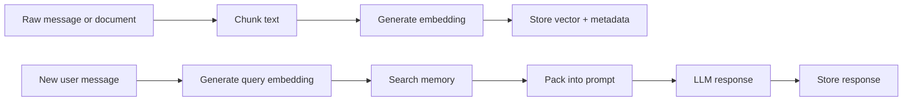

# Memory Model

## Goals

The memory layer provides durable, local, semantic recall across sessions. It is not a replacement for the model context window; it is a context assembly system that retrieves relevant facts and history just before generation.

## Memory lifecycle



## Schema

```ts
interface MemoryChunk {
  id: string;
  text: string;
  embedding: number[];
  sessionId: string;
  source: "chat" | "document" | "summary" | "tool" | "system";
  role?: "system" | "user" | "assistant" | "tool";
  createdAt: string;
  updatedAt: string;
  tags: string[];
  metadata: Record<string, unknown>;
  tokenCount: number;
}
```

## Chunking policy

Initial settings:

- `chunkTokens`: 220
- `overlapTokens`: 40
- `minChunkTokens`: 4 for chat, higher for documents

Why this size:

- Small enough for focused retrieval.
- Large enough to preserve local meaning.
- Cheap for browser embedding models.

## Retrieval policy

Default query:

1. Embed the latest user message.
2. Search top `memoryTopK` chunks.
3. Drop hits below `minScore`.
4. Pack the strongest hits until `maxRetrievedMemoryTokens` is reached.
5. Add recent conversation tail.

## Summaries

The MVP stores raw chunks. Production should add summary layers:

| Memory type | Purpose | Suggested TTL |
|---|---|---|
| Raw chunks | Verbatim recall | Long |
| Session summary | Compress one chat session | Long |
| Project summary | Stable state across sessions | Very long |
| Preference memory | User preferences and durable facts | Very long |
| Ephemeral cache | Current task scratchpad | Short |

## Deletion and privacy

A user-facing product must include:

- [x] Clear all memory.
- [x] Delete memory by session.
- [x] Delete memory by tag/project.
- [x] Export memory to JSON bundle.
- [x] Import memory from JSON bundle.
- [x] Secret detector before memory write.

Targeted deletion is exposed as `deleteMemory({ sessionId?, tags? })` on memory stores. At least one scope is required so targeted deletion cannot accidentally become clear-all.
