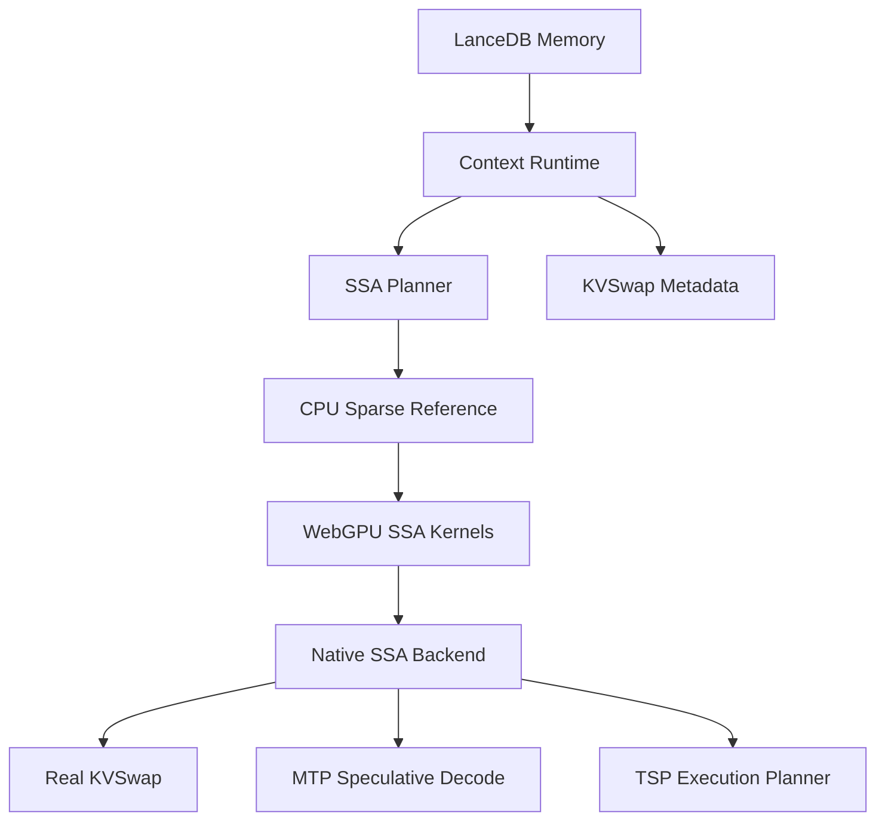

# 28 — Advanced Runtime Build Order

## Principle

Every advanced subsystem is first-class from day one, but implementation must proceed in dependency order. The app should never be rewritten when a fallback becomes a native implementation.

## Dependency graph

## Milestone 0 — Repo contracts

Deliver:

- runtime feature flags,
- TypeScript interfaces for all advanced systems,
- docs for contracts and gates,
- examples configs.

Done when:

- app compiles,
- all advanced modes have explicit config,
- no advanced concept exists only in prose.

## Milestone 1 — LanceDB-first memory

Deliver:

- sidecar memory server,
- schema migration path,
- vector + raw transcript linkage,
- provenance IDs.

Done when:

- every conversation turn writes durable memory,
- every context rebuild returns traceable memory IDs.

## Milestone 2 — Context Runtime

Deliver:

- active context graph,
- anchors,
- pinned constraints,
- memory hits,
- summaries,
- trace output.

Done when:

- no LLM call is made without a context runtime trace.

## Milestone 3 — SSA planner mandatory

Deliver:

- block generation,
- route reasons,
- anchor pinning,
- sparse budget enforcement,
- dropped-block trace.

Done when:

- every LLM call passes through an SSA plan, even if fallback packing is used.

## Milestone 4 — SSA CPU tensor references

Deliver:

- dense reference attention,
- sparse reference attention,
- block selection references,
- parity fixtures.

Done when:

- toy tensor tests pass and produce route/output metrics.

## Milestone 5 — WebGPU SSA kernels

Deliver:

- block summary shader,
- block scoring/top-k shader,
- KV gather shader,
- sparse attention shader,
- CPU-vs-GPU parity tests.

Done when:

- WebGPU sparse output matches CPU sparse output on toy fixtures within tolerance.

## Milestone 6 — Custom backend bridge

Deliver:

- model backend contract implementation,
- Q/K/V tensor access,
- layer-level sparse forward,
- dense reference mode for small contexts.

Done when:

- one transformer layer can be executed through the SSA kernel path.

Current implementation:

- `NativeEdgeReferenceBackend` proves the backend contract with backend-owned Q/K/V and KV-cache handles.
- The reference backend executes one tiny layer through the shared SSA sparse-forward path and validates dense parity.
- `UnlockedBrowserTransformerBackend` is the production target bridge: it owns browser model weights, creates Q/K/V handles during prefill, and executes sparse layer forward through the SSA backend.
- Opaque browser chat APIs are not production fallbacks for the unlocked lane because they do not expose model-layer Q/K/V handles for native SSA.

## Milestone 7 — KVSwap real paging

Deliver:

- KV block registry,
- hot/warm/cold tiers,
- predictive prefetch from SSA selected blocks,
- disk serialization format.

Done when:

- selected blocks are available before sparse attention executes.

Current implementation:

- `KVTensorPagingRegistry` registers KV blocks with optional backend tensor handles.
- Blocks page across hot/warm/cold residency backed by `vram`, `ram`, and serialized `disk` tiers.
- Selected blocks are promoted to VRAM before sparse attention, while pinned blocks are protected from eviction.
- The unlocked browser transformer registers layer-scoped KV blocks and prefetches selected blocks before attention.

## Milestone 8 — MTP/speculative decoding

Deliver:

- draft model wrapper,
- target verifier wrapper,
- acceptance sampler,
- trace of accepted/rejected tokens.

Done when:

- output quality matches target-only generation on deterministic fixtures.

Current implementation:

- `verifySpeculativeBatch` batches multiple draft branches through one verifier backend.
- Per-branch accepted/rejected token traces and scoped metrics are emitted per model pair and task type.
- Backend request and branch mismatches fail closed with request/branch context.

## Milestone 9 — TSP planner integration

Deliver:

- memory estimator,
- folded sequence/tensor partition plan,
- backend execution schedule.

Done when:

- backend can execute larger contexts without OOM compared with baseline on supported hardware.

Current implementation:

- `executeTSPSchedule` consumes planner-emitted `TSPScheduleStep[]` and dispatches backend callbacks.
- Execution preflights missing callbacks before mutation, preserves planner order within shard coordinates, and records trace rows.
- Production native backends can attach real kernel callbacks to the completed schedule contract.
- The unlocked browser transformer decode path executes `kv_prefetch`, `attention`, and `mlp` callbacks through this schedule.

## Non-negotiable checks

- Native SSA may be claimed only where backend-owned Q/K/V handles execute through sparse attention.
- KVSwap may be claimed for `KVBlock.tensorHandles` owned by a backend and paged through `KVTensorPagingRegistry`.
- TSP may be claimed for callback-backed schedule execution through `executeTSPSchedule`.
- MTP may be claimed for target verification through `verifySpeculativeBatch`; accelerated MTP needs a tokenizer-compatible draft model and target verifier that preserve target-only output quality.
- Production full-control may be claimed only for `unlocked-browser-transformer` with a real converted model manifest and browser-validated generation quality; fixture weights are a local proof harness and are blocked by production readiness.
