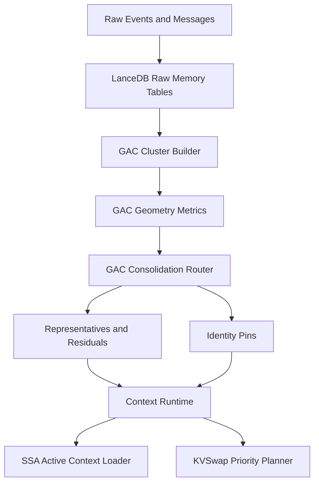

# 29 — Geometry-Aware Memory Consolidation

## Purpose

This document defines Geometry-Aware Memory Consolidation, abbreviated **GAC**, as a first-class subsystem in the Infinite Edge Agent. GAC is the layer that decides whether long-term memories can be compressed without destroying the identity of the original facts.

The system must not treat consolidation as summarization. Summaries are useful for human-readable context, but they are not reliable ground truth. GAC exists because a persistent agent needs to grow without becoming bloated, and it must compact memory without corrupting the facts that made the memory useful.

## Source foundation

The design is based on the public Geometry of Consolidation repository and its core claim: when a semantic memory replaces many cluster members with fewer representatives, the geometry of the cluster determines whether retrieval can still recover the original members.

Reference: https://github.com/niashwin/geometry-of-consolidation

The repo states the practical rule as a separator between a tight regime and a spread regime:

- Tight clusters can be represented cheaply.
- Spread clusters force identity collapse under non-trivial compression.
- A geometry-aware router should choose the consolidation strategy rather than always using a centroid.

We will not treat the paper as a production-proven universal law. We will treat it as a strong design primitive and validate it in our own memory benchmarks.

## Problem

A persistent agent stores many kinds of memory:

1. User instructions.
2. Project decisions.
3. System preferences.
4. Codebase facts.
5. Chat transcripts.
6. Files and source material.
7. Agent reflections.
8. Build failures and fixes.
9. External references.
10. Business, legal, and operational facts.

A naive memory system eventually fails in one of two ways:

1. It keeps everything, which causes retrieval noise, context bloat, and high storage cost.
2. It summarizes or clusters aggressively, which creates memory drift and identity collapse.

The failure is dangerous because the agent may still sound confident after memory corruption. It may remember the broad topic while forgetting the exact constraint.

Example:

- Raw exact memory: "SSA is first-class from the start, not a future research adapter."
- Bad compressed memory: "The user discussed SSA research."

The second memory is not equivalent. It destroys the engineering decision.

## Design goal

GAC must answer this question for every memory cluster:

**Can this group of memories be represented with fewer vectors while preserving the ability to retrieve the original identity-critical facts?**

The answer must be operational. The output is not merely an explanation. It must produce a consolidation decision used by LanceDB, the Context Runtime, SSA routing, and KVSwap priority.

## First-class position in the architecture

GAC sits between persistent memory and active context construction.

## Core idea

Every memory item is stored exactly first. GAC then computes geometry over semantic neighborhoods and creates derived memory representatives.

The raw memory is the source of truth.

The representative is an acceleration structure.

The lineage table connects every representative back to the exact raw memories it represents.

## Consolidation outputs

GAC can produce the following decisions:

### 1. No compression

Use when the cluster has high spread, high identity risk, or contains source-critical facts.

Examples:

- Legal facts.
- Exact user preferences.
- Architecture decisions.
- Dates, names, URLs, prices, promises, contracts.
- Code decisions or bug fixes.
- Contradictory memories that require disambiguation.

### 2. Centroid representative

Use when the cluster is tight and low risk.

Examples:

- Repeated identical notes.
- Near-duplicate file chunks.
- Repetitive chat fragments.
- Equivalent status updates.

### 3. Medoid representative

Use when a real member is safer than an artificial centroid. A medoid remains an actual memory item and therefore has exact lineage.

Examples:

- User instructions with similar wording.
- Project notes with a central canonical decision.
- Repeated examples where one real example is the best anchor.

### 4. Medoid plus residual representatives

Use when the cluster is not fully safe to merge but can still be represented with a small budget.

The medoid gives a canonical exact anchor. Residuals preserve directions of difference inside the cluster.

Examples:

- Related but distinct implementation ideas.
- A set of architecture constraints around one subsystem.
- Multiple decisions in the same topic area.

### 5. Split cluster

Use when a cluster has mixed concepts or high internal variance.

Examples:

- "Vercel" appearing in deployment, sandbox, database, and billing discussions.
- "Memory" appearing in browser storage, model memory, vector memory, and legal memory.

### 6. Identity pin

Use when a memory must always be retrievable exactly.

Identity pins bypass compression and are copied into special high-priority retrieval indexes.

## Data model summary

GAC introduces these persistent entities:

- `raw_memory`: immutable exact memory record.
- `memory_cluster`: grouping over raw memories.
- `cluster_metric`: geometry measurement over the cluster.
- `memory_representative`: centroid, medoid, or residual vector.
- `memory_lineage`: mapping from representative to raw memories.
- `identity_pin`: exact memory that must not be compressed.
- `consolidation_run`: auditable background job record.
- `retrieval_audit`: evidence that retrieval preserved or failed identity.

Detailed schemas are defined in `30_LANCEDB_GAC_SCHEMA.md`.

## Engineering rule

No memory may be physically deleted just because it was consolidated.

A representative can replace raw memories for fast retrieval, but raw memory remains available for exact recall, audits, source grounding, and future re-consolidation.

## Runtime contract

The GAC runtime exposes these core operations:

- Ingest raw memory.
- Build or update clusters.
- Compute cluster geometry.
- Choose consolidation strategy.
- Write representatives.
- Pin identity-critical memories.
- Provide retrieval candidates to the Context Runtime.
- Emit cache-priority signals to KVSwap.
- Emit routing-priority signals to SSA.
- Run validation probes to detect identity collapse.

## MVP implementation path

### Phase 1 — exact memory plus identity pins

Implement raw memory, identity pin policy, and source lineage. No compression yet.

Acceptance gate: every retrieved memory can be traced to exact raw text and source metadata.

### Phase 2 — cluster metrics

Implement cluster construction and simple metrics: mean within-cluster distance, max distance, nearest-neighbor radius, and local density.

Acceptance gate: cluster metric outputs are stored and visible in debug UI.

### Phase 3 — consolidation router

Implement centroid, medoid, medoid-plus-residual, split, and no-compression decisions.

Acceptance gate: router decisions are deterministic for the same input bundle.

### Phase 4 — context packing integration

Context Runtime uses representatives for broad context and raw pinned memory for exact constraints.

Current implementation: context rebuild reads prior context-pack traces, retrieval audits, identity pins, and raw recovery records before packing. It boosts previously useful memories through stable raw/representative/pin lineage, repairs failed identity-retrieval probes by recovering the missed raw memory even when vector search omits it, protects exact pins, and emits priority, lineage, learning, and raw-recovery maps in the runtime trace. SSA, KVSwap, and predictive planning consume only the active packed context instead of dropped retrieval frames.

Acceptance gate: context packs include both representative summaries and exact pinned facts, and failed identity-retrieval probes alter the next rebuild priority map.

### Phase 5 — SSA/KVSwap integration

SSA and KVSwap consume GAC signals.

Acceptance gate: identity-pinned memories receive elevated routing and cache scores.

The browser/local ingestion queue also schedules adaptive consolidation jobs when the store exposes the full GAC surface. Scheduled jobs protect pinned, legal, security, and failed-audit raw memories before selecting normal raw-memory candidates for background consolidation.

### Phase 6 — model-native controller

Add model-facing heads/prompts/tools for memory write, compression, split, and pin decisions.

Acceptance gate: the agent can explain why a memory was compressed, pinned, split, or left raw.

## Non-goals

GAC is not a replacement for LanceDB.

GAC is not a replacement for SSA.

GAC is not a replacement for raw storage.

GAC is not a truth oracle.

GAC is not allowed to silently rewrite memory.

## Key implementation warning

The raw memory record must always outlive its derived representative. Otherwise, the system gradually turns into a chain of summaries, and truth is lost.
