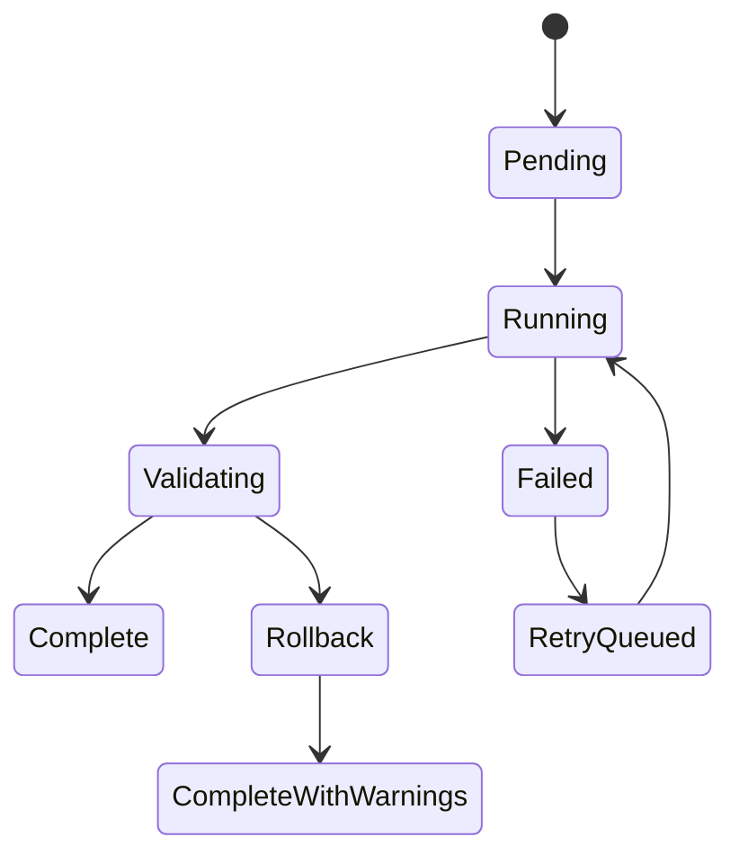

# 32 — Memory Consolidation Jobs

## Purpose

This document defines background and foreground jobs that keep memory useful over time.

The system needs memory consolidation cycles because a persistent cell will generate more memory than can be actively loaded or searched naively. Consolidation jobs compact the retrieval surface while preserving exact raw memory and source lineage.

## Job types

### 1. Immediate ingestion job

Runs after each user message, tool result, file upload, code change, or agent decision.

Responsibilities:

- Write raw memory.
- Generate embedding.
- Apply identity pin policy.
- Attach source metadata.
- Add to pending cluster queue.

Latency budget: low. This job must not block UI.

### 2. Micro-consolidation job

Runs after a small batch of new memories.

Responsibilities:

- Detect duplicates.
- Merge near-identical embeddings into same local cluster.
- Create pin shadows for exact constraints.
- Update recent context summaries.

Latency budget: seconds.

### 3. Hourly consolidation job

Runs periodically for active cells.

Responsibilities:

- Recompute local clusters.
- Compute cluster metrics.
- Route clusters to consolidation strategies.
- Write representatives and lineage.
- Run retrieval probes.

Latency budget: background.

### 4. Daily consolidation job

Runs for active projects/cells.

Responsibilities:

- Re-cluster across larger memory regions.
- Find contradictions.
- Detect stale representatives.
- Build training examples from model memory actions.
- Update project-level memory maps.

Latency budget: background.

### 5. Sleep-cycle consolidation job

Runs when a cell hibernates or becomes idle.

Responsibilities:

- Write final session state.
- Extract decisions and unresolved tasks.
- Pin exact constraints.
- Consolidate low-risk discussion.
- Build wake context.
- Record sleep summary.

This is the most important job for Master Commander style persistent cells.

### 6. Manual consolidation job

Triggered by user or admin.

Responsibilities:

- Re-run consolidation with selected policy.
- Repair bad clusters.
- Rebuild memory after embedding model migration.
- Audit or export memory lineage.

### 7. Migration consolidation job

Runs when changing embedding model, LanceDB schema, GAC policy, or model-native memory controller version.

Responsibilities:

- Re-embed memories.
- Recompute clusters.
- Preserve old representatives until new ones pass validation.
- Version all outputs.

## Job state machine

## Job isolation

Consolidation jobs must not block active chat or inference.

Recommended execution:

- Browser worker for small jobs.
- Local sidecar process for LanceDB-heavy jobs.
- Server/edge worker only if user enables cloud sync.
- Dedicated queue per cell.

## Job locking

Use locks to prevent two jobs from rewriting the same cluster version simultaneously.

Lock granularity:

- Tenant lock for migrations.
- Cell lock for sleep cycle.
- Cluster lock for normal consolidation.
- Raw memory ID lock for immediate ingestion.

## Priority order

1. User deletion and privacy requests.
2. Identity pin ingestion.
3. Active task memory.
4. Sleep-cycle memory.
5. Hourly consolidation.
6. Daily consolidation.
7. Low-priority compression.

## Sleep-cycle job details

The sleep job should produce:

- `wake_context.md` derived record.
- Updated identity pins.
- Project decision log.
- Open tasks list.
- Representative records.
- Consolidation audit.
- Retrieval probes for pinned facts.

The cell should be able to wake up from this state without replaying all history.

## Rollback policy

A consolidation run must be reversible at the representative layer.

Rollback does not need to delete raw memory because raw memory should never be changed.

Rollback must:

- Mark representatives from the bad run as inactive.
- Restore previous active representative set.
- Mark affected clusters for reprocessing.
- Store failure reason.

## Observability metrics

Track:

- Raw memory count.
- Representative count.
- Compression ratio.
- Identity pin count.
- Average cluster spread.
- High-risk cluster count.
- Retrieval hit@k for pinned probes.
- Representative stale rate.
- Consolidation job duration.
- Rollback count.
- User correction count.

## Acceptance gates

- Jobs are idempotent by run ID.
- Jobs are replayable from raw memory.
- Failed consolidation never corrupts raw memory.
- Sleep-cycle output can rebuild useful context.
- Migrations preserve old memory until new memory passes retrieval audit.
