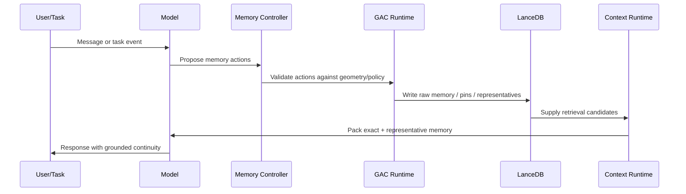

# 34 — Model-Native Geometry-Aware Consolidation

## Purpose

This document defines the model-native version of Geometry-Aware Memory Consolidation.

The goal is to move beyond "LLM plus vector database" and build a model/runtime that has a native memory organ: it can decide what to write, what to retrieve, what to compress, what to pin, and what to keep exact.

## Core distinction

Do not put all memories directly into model weights.

Instead, build memory behavior into the model and runtime while storing mutable memories externally with lineage.

The model should learn and execute memory operations. The memory store remains external, auditable, and updateable.

## Why not store user memory in weights

Putting live user memory directly into model weights creates problems:

- Hard to update.
- Hard to delete.
- Hard to audit.
- Expensive to train continuously.
- Risk of catastrophic forgetting.
- Risk of privacy leakage.
- Difficult to prove provenance.
- Difficult to distinguish learned capability from stored fact.

The right architecture is:

```text
Base model weights = stable language/reasoning capability
Memory controller = learned/runtime policy for memory actions
External memory = mutable, source-grounded facts
GAC = geometry-aware safety and compression layer
```

## Three levels of integration

### Level 1 — Tool-native GAC

The model calls GAC as an external tool.

Use this first.

The model emits structured memory actions:

- `write_memory`
- `pin_memory`
- `retrieve_raw`
- `compress_cluster`
- `split_cluster`
- `mark_contradiction`
- `request_reconsolidation`

The GAC runtime approves, rejects, or modifies the action.

### Level 2 — Runtime-native GAC

The model does not merely call a tool. The runtime automatically uses GAC signals in:

- Context packing.
- SSA routing.
- KVSwap priority.
- LanceDB compaction.
- Sleep-cycle consolidation.
- Evaluation probes.

This is the default production target.

### Level 3 — Model-native GAC

The transformer or wrapper model includes dedicated heads/adapters for memory operations:

- Memory write head.
- Retrieval intent head.
- Consolidation action head.
- Identity-risk head.
- Source-grounding head.
- Forget/demote head.

This requires training or fine-tuning.

## Relationship to tool-using models

Toolformer showed that language models can learn to call external APIs such as calculator, search, translation, and calendar tools.

Our system applies the same pattern to memory consolidation, but with a more complex tool and stronger policy requirements.

A calculator call answers a deterministic stateless question.

A GAC call changes the memory lifecycle. Therefore it must be:

- Audited.
- Policy-gated.
- Reversible where possible.
- Source-linked.
- Evaluated against identity recall.

## Relationship to retrieval-native models

RETRO, kNN language models, Memorizing Transformers, Product Key Memory, and Compressive Transformers all show variants of adding memory or retrieval to neural models.

Our difference:

- Retrieval is not enough.
- Compression is not enough.
- Memory needs geometry-aware identity preservation.
- The model must learn when not to merge memories.

## Model-native memory action loop



## Model memory actions

### write_memory

Create a raw memory from an event.

Required fields:

- `text`
- `memory_kind`
- `source_uri`
- `importance`
- `identity_risk_hint`

### pin_memory

Mark a raw memory as identity-critical.

Required fields:

- `raw_memory_id`
- `pin_reason`
- `pin_strength`

### retrieve_raw

Request exact memory lineage behind a representative.

Required fields:

- `representative_id`
- `reason`

### compress_cluster

Request consolidation of a cluster.

Required fields:

- `cluster_id`
- `preferred_strategy`
- `reason`

### split_cluster

Request cluster splitting due to mixed concepts.

Required fields:

- `cluster_id`
- `split_reason`
- `candidate_axes`

### mark_contradiction

Record conflict between memories.

Required fields:

- `memory_ids`
- `contradiction_type`
- `resolution_status`

## Policy gate

The memory controller must never blindly execute model memory actions.

Policy checks:

- Does action violate user deletion or privacy preference?
- Does action compress a pinned memory?
- Does action hide contradiction?
- Does action lack source?
- Does action attempt to create false source-grounding?
- Does action demote legal/security/financial facts?

## Engineering target

For v1 production, implement Level 1 and Level 2.

For research/prototype, implement Level 3 using adapters or a small side model before modifying the main model.

## Acceptance gates

- Model can propose memory actions in structured form.
- Runtime can reject unsafe memory actions.
- Every memory action is logged.
- Context packing improves with GAC signals.
- Pinned facts survive sleep/wake cycles.
- Model-native decisions are evaluated against identity recall, not just response quality.
