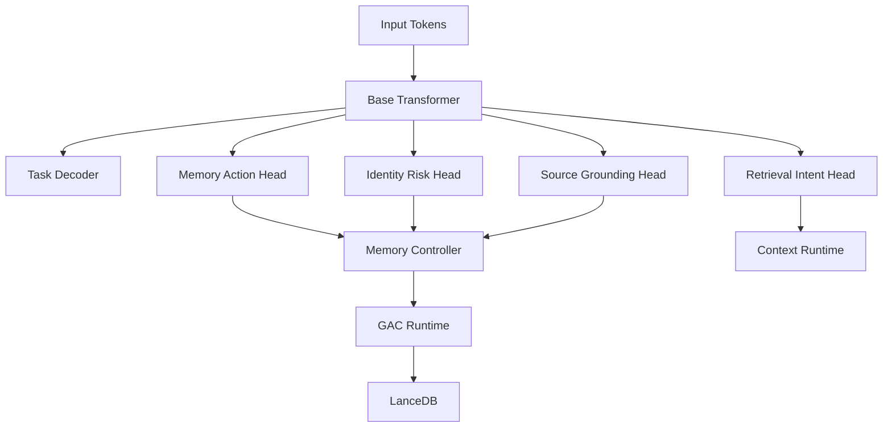

# 35 — Consolidation-Native Transformer

## Purpose

This document defines the research architecture for a transformer or transformer wrapper that contains native memory-consolidation machinery.

This is the long-term model architecture target. The production system should first implement external/runtime GAC, then train model-native components from the logs.

## Architecture summary

A consolidation-native transformer contains:

1. Base language model.
2. Retrieval cross-attention or retrieval adapter.
3. Memory action head.
4. Identity-risk head.
5. Compression-safety head.
6. Source-grounding head.
7. Memory write head.
8. Optional sleep-cycle summarizer adapter.
9. Optional SSA routing adapter.
10. Optional KV priority adapter.

## High-level flow

## Component: memory action head

Predicts memory operations at event boundaries.

Actions:

- `NOOP`
- `WRITE_RAW`
- `PIN_EXACT`
- `MERGE_SAFE`
- `SPLIT_CLUSTER`
- `FETCH_RAW_LINEAGE`
- `MARK_CONTRADICTION`
- `DEMOTE_LOW_VALUE`
- `REQUEST_HUMAN_CLARIFICATION`

Output shape:

- token-level logits for action triggers.
- span-level arguments.
- memory ID references.
- confidence score.

## Component: identity-risk head

Predicts whether a memory can survive compression.

Output:

- `identity_risk_score`: 0..1.
- `protected_category`: enum.
- `raw_required`: boolean.
- `pin_recommendation`: boolean.

Training labels come from:

- Policy rules.
- GAC geometry metrics.
- Retrieval failure audits.
- User corrections.
- Synthetic perturbation tests.

## Component: compression-safety head

Predicts strategy for a cluster:

- centroid.
- medoid.
- medoid plus residuals.
- split.
- no compression.

The head is trained to match GAC router decisions and retrieval-preservation outcomes.

## Component: source-grounding head

Predicts whether a model statement requires source-backed memory.

This prevents the model from treating generated summaries as truth.

Outputs:

- source required.
- exact quote required.
- representative sufficient.
- lineage fetch required.

## Component: retrieval intent head

Predicts when the model needs more memory before answering.

Outputs:

- retrieve now.
- retrieve exact raw.
- retrieve broad background.
- retrieve contradiction history.
- retrieve source document.
- no retrieval needed.

## Component: memory write head

Predicts which input spans should be written as durable memory.

It must separate:

- Useful lasting facts.
- Temporary context.
- User preferences.
- Architecture decisions.
- Tool outputs.
- Low-value chatter.

## Integration with SSA

SSA routing can consume identity-risk and source-grounding signals.

A consolidation-native transformer should emit per-block metadata:

- `attention_priority`
- `identity_priority`
- `source_priority`
- `recency_priority`
- `task_priority`

The SSA planner can combine these with sparse query/key routing.

## Integration with KVSwap

KVSwap can consume cache priority predictions:

- Keep hot.
- Keep warm.
- Swap cold.
- Prefetch soon.
- Pin during task.

The identity-risk head gives KVSwap a reason not to evict old but critical facts.

## Integration options

### Option A — No model modification

Use prompt/tool format to ask the base model for memory actions.

Pros: fastest.

Cons: less reliable, prompt-sensitive.

### Option B — Small controller model

Train a separate small model to predict memory actions from context and GAC metrics.

Pros: cheap, modular, safe.

Cons: extra runtime component.

### Option C — LoRA/adapters on base model

Fine-tune adapters for memory actions and identity-risk prediction.

Pros: stronger integration.

Cons: model-specific.

### Option D — Full architecture modification

Add heads inside transformer and train with multi-objective loss.

Pros: strongest.

Cons: expensive and research-heavy.

## Recommended path

1. Runtime-only GAC.
2. Generate training logs.
3. Train small controller model.
4. Add LoRA/adapters to open model.
5. Explore full transformer modification.

## Acceptance gates

- Memory action head improves write/pin decisions over rules alone.
- Identity-risk head predicts retrieval failures before they happen.
- Compression-safety head reduces identity collapse versus centroid baseline.
- Source-grounding head reduces unsupported memory claims.
- SSA/KVSwap priority signals improve long-session reliability.
