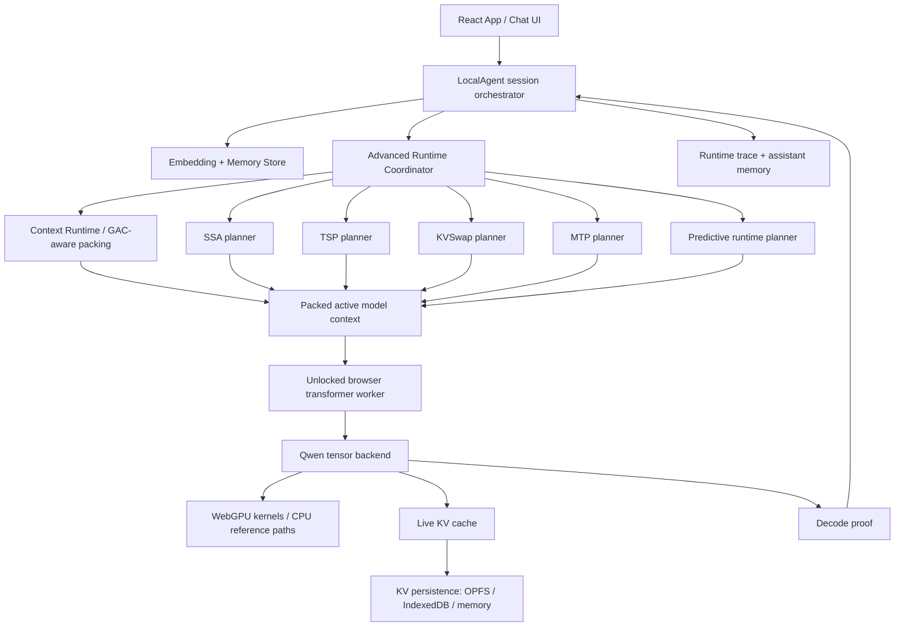
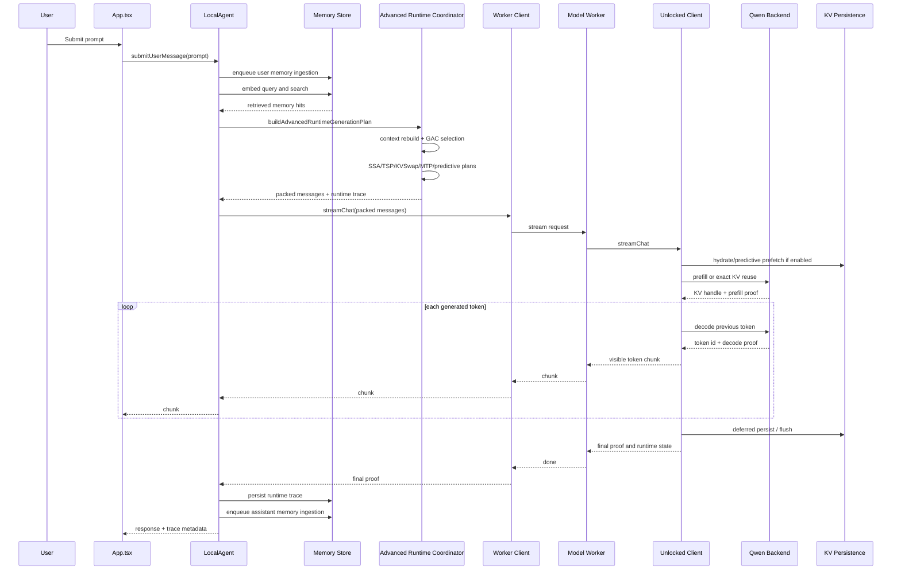

# 55 - Current Codebase Architecture And Prompt Trace

Prepared from the current `infinite-edge-agent-v4` workspace on 2026-05-23.

This document describes what the codebase actually does today, how a submitted prompt moves through the system, which trace surfaces are produced, what is genuinely implemented, and where the remaining dream-state gaps still are.

## 1. Current Truth In One Sentence

The project is a browser-first persistent AI runtime: a React app captures the turn, a local agent rebuilds working context from browser/remote memory, the core runtime plans context, SSA, TSP, KVSwap, MTP, and predictive cache behavior, and an unlocked browser-owned Qwen runtime streams tokens while emitting proof traces for WebGPU, KV persistence, context packing, memory grounding, and benchmark gates.

It is not just a chatbot wrapper. The model is one subsystem inside a larger runtime that tries to own memory, context rebuilding, cache lifecycle, and execution proof.

## 2. Repository And Package Map

Primary workspace:

```text
infinite-edge-agent-v4/
  apps/web/                  Browser app, chat UI, workers, browser benchmark route
  packages/core/             Runtime contracts and planning logic
  scripts/                   Verifiers, converters, release gates, benchmark launchers
  docs/                      Architecture and release documentation
  .artifacts/evals/          Local verification and benchmark artifacts
```

Important packages:

| Package | Role |
|---|---|
| `@infinite-edge-agent/web` | React/Vite browser app, browser workers, IndexedDB memory, OPFS KV persistence, browser runtime benchmark route. |
| `@infinite-edge-agent/core` | Context packing, advanced runtime coordinator, SSA/TSP/KVSwap/MTP planning, WebGPU-capable unlocked transformer backend. |
| `scripts/*` | CLI gates for unlocked model verification, browser benchmark orchestration, release gate, production eval, Qwen parity eval, and headless WebGPU checks. |

Important source files:

| File | What It Owns |
|---|---|
| `apps/web/src/App.tsx` | Main UI, initialization, memory store setup, agent creation, prompt submission, streaming output, memory export/import/delete, page-hide KV flushing. |
| `apps/web/src/config.ts` | Runtime defaults: unlocked Qwen model, WebGPU preference, memory provider, MTP defaults, KV persistence defaults, strict kernel requirement. |
| `apps/web/src/lib/agent/localAgent.ts` | Per-turn orchestration: memory ingestion, query embedding, memory search, runtime plan construction, LLM streaming, runtime trace persistence. |
| `packages/core/src/runtime/advancedRuntimeCoordinator.ts` | The central coordinator: context rebuild signals, GAC-aware memory recovery, context packing, SSA, TSP, KVSwap, MTP, predictive runtime, trace writing. |
| `packages/core/src/runtime/contextRuntime.ts` | Adaptive memory selection, pinned identity handling, context frames, dropped-frame accounting, priority and lineage maps. |
| `packages/core/src/contextPacking.ts` | Converts system prompt, retrieved memory, recent messages, and current user request into model-visible chat messages. |
| `apps/web/src/lib/llm/unlockedBrowserTransformerWorkerClient.ts` | Main-thread proxy for the model worker; serializes stream/init/flush/clear/dispose messages. |
| `apps/web/src/workers/unlockedTransformer.worker.ts` | Dedicated inference worker owning one unlocked transformer client and serializing operations. |
| `apps/web/src/lib/llm/unlockedBrowserTransformerClient.ts` | Browser-side model client: loads manifest, formats prompt, tokenizes, performs prefill/decode, manages MTP, KV persistence, output filtering, proof traces. |
| `packages/core/src/runtime/unlockedBrowserTransformer.ts` | Actual Qwen tensor runtime: prefill, decode, SSA attention, TSP callbacks, MLP, projections, logits, KV handles, WebGPU/CPU proof metadata. |
| `apps/web/src/lib/runtime/kvSwapPersistence.ts` | KV block persistence backends: binary OPFS, async JSON OPFS, IndexedDB, memory, validation, health and trace events. |
| `apps/web/src/workers/kvSwapPersistence.worker.ts` | Single-worker KV persistence router for serialized OPFS/IndexedDB operations. |
| `apps/web/src/bench/browserPreviewBenchmarkRoute.tsx` | Real browser benchmark route at `/__bench/browser-runtime`; creates clients, runs prompts, memory grounding, KV proof, strict WebGPU proof, long-prompt proof. |
| `apps/web/src/bench/browserPreviewBenchmark.ts` | Benchmark payload schema and pass/fail logic for speed, quality, memory grounding, stop quality, repetition, KV reuse, MTP, and WebGPU gates. |

## 3. Runtime Layer Model

The architecture is a stacked runtime, not a single prompt builder.



### Layer 1 - App Shell

The app renders the chat surface and owns the visible user workflow. It initializes:

- browser memory,
- embedding client,
- startup context snapshot,
- selected chat client,
- `LocalAgent`,
- runtime status,
- KV health status.

On `pagehide` or when the page becomes hidden, the app asks the active LLM client to flush pending KV persistence. This matters because KV writes are now deferred out of the first-token critical path.

### Layer 2 - Memory Store

The memory layer is selected by config:

- `browser-vector` / `indexeddb`: browser-local IndexedDB vector store.
- `remote-http`: same-origin or configured remote memory API, with production checks against bundled browser secrets.
- sidecar/LanceDB style paths: larger local/desktop memory engine when available.

Current browser production posture is local-first: `browser-vector` is a valid production-compatible mode, and `indexeddb` is its compatibility alias.

### Layer 3 - LocalAgent

`LocalAgent` is the first real runtime object after the UI. It owns a turn from user message to persisted assistant trace.

It does all of this for every submitted message:

1. Creates a user chat message.
2. Starts background memory ingestion for that user message.
3. Embeds the user query.
4. Searches memory.
5. Calls the advanced runtime coordinator.
6. Streams through the selected LLM client.
7. Flushes pending KV persistence opportunistically after generation.
8. Attaches decode proof to the runtime trace.
9. Persists the runtime trace.
10. Creates the assistant chat message.
11. Starts background memory ingestion for the assistant response.

The important detail: the model does not directly read "all memory." The agent retrieves memory and asks the context/runtime layers to decide what becomes active model-visible context.

### Layer 4 - Advanced Runtime Coordinator

The coordinator is the runtime brain for a turn. It takes:

- current user message,
- recent chat messages,
- retrieved memory,
- model capabilities,
- runtime config,
- context trace store methods,
- optional current goal metadata.

Then it builds:

- context runtime plan,
- packed model messages,
- TSP schedule plan,
- SSA sparse routing plan,
- KVSwap hot/warm/cold block plan,
- MTP speculative plan,
- predictive runtime plan,
- feature status map,
- runtime trace,
- context-pack trace.

This is the code path that turns "retrieve chunks, build prompt" into "reconstruct working cognition and execution strategy."

### Layer 5 - Context Runtime

The context runtime makes memory selection adaptive. It uses:

- retrieved vector hits,
- identity pins,
- prior context-pack traces,
- retrieval audits,
- raw memory recovery records,
- GAC raw/representative lineage,
- dropped-frame accounting.

It produces:

- frames selected for context,
- memory priority map,
- source lineage map,
- dropped frame IDs and reasons,
- context rebuild learning metadata,
- packed context inputs.

Pinned exact memory and identity-risk memory can be protected even when ordinary vector scores are not enough. Failed retrieval audits can also boost raw memories back into the active set.

### Layer 6 - SSA

SSA is currently both a planner and a WebGPU execution proof surface.

The planner selects context blocks for attention based on:

- current user block,
- system/constraint blocks,
- pinned or must-attend blocks,
- memory priority,
- semantic score,
- token budget.

The transformer backend then uses sparse attention kernels where possible and records:

- selected block IDs,
- packed head backend,
- dispatch count,
- CPU/WebGPU backend per attention path,
- whether attention was prefill or decode,
- whether chunked prefill ran.

### Layer 7 - TSP

TSP is the scheduling layer for memory/activation/KV pressure. Today it builds a fallback schedule and traces steps such as:

- `kv_prefetch`,
- `attention`,
- `mlp`.

During decode, the unlocked backend executes a schedule with callbacks. The planner side is real and traced; deeper distributed-memory execution remains a frontier area.

### Layer 8 - KVSwap

KVSwap has two pieces:

1. Core planning: chooses hot/warm/cold KV blocks, eviction, pinned blocks, and predictive prefetch candidates.
2. Browser persistence: serializes actual prefill KV rows into browser storage for exact reuse and low-rank predictive prefetch proof.

KV persistence modes:

- `opfs` binary sync-handle records when worker-owned OPFS coordination is available.
- `opfs` async JSON fallback.
- `indexeddb` transaction fallback.
- `memory` fallback for tests or unavailable browser storage.

The binary OPFS path records:

- `binary: true`,
- `syncAccessHandle: true`,
- `webLocks` or `single_worker_route`,
- lock wait time,
- bytes read/written,
- quota and usage,
- validation/quarantine events.

Exact KV reuse requires strict identity matching:

- namespace,
- model ID/fingerprint,
- prompt token IDs,
- prompt hash,
- runtime layer count,
- policy hash,
- serialized Q/K/V/hidden row ranges.

Predictive KVSwap uses persisted low-rank key summaries. When exact reuse misses, the client can score persisted blocks against the current query summary, choose predicted hot blocks, and schedule async loads while fresh prefill runs. The trace reports whether the query source was `persisted_q_rows` or `token_id_fallback`.

### Layer 9 - MTP

MTP exists, but production defaults keep it off.

`MTP_ENABLED` is false unless `VITE_MTP_ENABLED=true`. When enabled, the code can create a tokenizer-compatible Qwen-prefix draft backend and run draft/verify. The verifier runs through the target backend and only commits accepted tokens into live KV.

Why it is off by default:

- Browser concurrency is usually 1.
- Drafting can cost more than it saves.
- The code requires paired target-only vs MTP speed proof before claiming acceleration.
- Production benchmark summaries treat `target_only` as the expected production mode.

So MTP is a lab feature, not a production speed claim.

### Layer 10 - Unlocked Browser Transformer

The unlocked backend owns the converted Qwen manifest and tensors in the browser. The default configured model is `Qwen/Qwen3-0.6B` with manifest path `/models/qwen3-0.6b-unlocked/manifest.json`.

It is responsible for:

- manifest fetch and SHA validation,
- tokenizer/chat template handling,
- token embeddings,
- RMSNorm,
- Q/K/V/O projections,
- RoPE/Qwen attention shape handling,
- prefill,
- decode,
- KV block construction,
- sparse attention,
- MLP,
- final norm,
- full-vocab top-k logits,
- proof traces.

The code contains both WebGPU and CPU-reference paths. Production strict lanes must fail or report failure if CPU reference is used for required kernel families. That distinction is visible in the benchmark gates.

## 4. Prompt-To-Response Flow

This is the actual turn path from submit to end result.



### Step 1 - UI Accepts The Prompt

`App.tsx` receives the prompt in `sendMessage`. It immediately:

- appends the user message to local React state,
- appends an empty assistant placeholder,
- calls `agentRef.current.submitUserMessage`,
- streams chunks back into the assistant placeholder,
- records runtime trace and KV health when generation finishes.

This is why the UI can show streaming output while the deeper runtime is still emitting proof metadata.

### Step 2 - User Message Enters LocalAgent

`LocalAgent.submitUserMessage` creates a typed user message and kicks off memory ingestion in the background. It does not block the turn on writing the user memory.

The ingestion path:

1. Redacts sensitive text.
2. Chunks text.
3. Embeds chunks.
4. Builds memory chunks.
5. Builds immediate GAC ingestion plan.
6. Upserts memory.
7. Writes ingestion plan if the store supports it.
8. Schedules consolidation jobs if the store supports raw memory and identity-pin APIs.

### Step 3 - Query Embedding And Memory Search

The same user text is embedded for retrieval. The selected memory store searches with tenant/cell/session filters and returns scored memory chunks.

The current browser-vector store supports deterministic vector search in IndexedDB and is used by the browser memory grounding benchmark.

### Step 4 - Context Rebuild Signals Are Loaded

The advanced runtime coordinator reads runtime memory around the current turn:

- previous context-pack traces,
- identity pins,
- retrieval audits,
- raw memory recovery candidates,
- raw/representative lineage.

This is the practical meaning of "every turn goes through context rebuild": before the model is called, the runtime reconstructs a temporary active cognition state from durable memory, recent chat, pins, audits, goals, and current retrieved knowledge.

The model itself only sees the final packed messages and whatever KV state exists. It does not directly see the whole memory database.

### Step 5 - GAC-Aware Context Runtime Selects Frames

`buildContextRuntimePlan` creates context frames:

- current user anchor,
- retrieved memory frames,
- recovered raw memory frames,
- pinned exact/identity-risk frames,
- prior-trace learning frames.

Then it chooses what fits into the token budget and records what was dropped. It emits:

- `memoryPriorityMap`,
- `sourceLineageMap`,
- `contextRebuildLearning`,
- `rawMemoryRecovery`,
- packed context inputs.

### Step 6 - Context Packing Builds Model Messages

`packContext` builds the actual model-visible chat messages.

The packed context usually contains:

1. System prompt.
2. Formatted memory context.
3. Recent conversation within budget.
4. Current user message.

It returns:

- `messages`,
- `includedMemoryIds`,
- `estimatedTokens`.

This is the boundary between memory/runtime state and model-visible prompt text.

### Step 7 - Runtime Planners Build Execution Metadata

The coordinator then builds the runtime plan:

- TSP fallback memory schedule.
- SSA sparse routing over active context blocks.
- KV blocks from selected context.
- KVSwap cache/prefetch/eviction plan.
- MTP mode and speculative settings.
- Predictive runtime plan for likely future retrievals, branches, KV hot pages, sparse blocks, and verifier pressure.

The output is both operational input to the LLM client and trace evidence for debugging.

### Step 8 - Context-Pack Trace Is Persisted

The coordinator writes a context-pack trace if the memory store supports it.

That trace includes:

- included memory IDs,
- raw memory IDs,
- representative memory IDs,
- identity pin IDs,
- token budget,
- omitted memory IDs,
- SSA routing blocks,
- KV priority metadata,
- predictive plan metadata,
- source lineage.

This trace becomes learning input for later turns.

### Step 9 - LLM Stream Begins

`LocalAgent` passes `runtimePlan.packed.messages` into the selected chat client.

For the unlocked browser runtime, the app generally uses:

- `UnlockedBrowserTransformerWorkerClient` on the main thread,
- `unlockedTransformer.worker.ts` in a Web Worker,
- `UnlockedBrowserTransformerClient` inside the worker,
- `UnlockedBrowserTransformerBackend` from core for tensor execution.

The worker serializes operations so multiple model runs do not stomp on the same live backend.

### Step 10 - Prompt Formatting And Tokenization

The unlocked client:

- applies the Qwen chat formatter,
- tokenizes the full prompt,
- trims prompt tokens to runtime budget,
- chooses prefill tokens and previous-token boundary,
- records prompt token diagnostics,
- builds chunk/policy hashes for KV reuse.

If `qwenThinkingMode` is disabled, the client filters Qwen thinking markers and hidden thought tags from visible output.

### Step 11 - KV Hydration, Exact Reuse, Or Fresh Prefill

Before fresh prefill, the client checks whether persisted KV blocks can be exactly reused.

If exact reuse passes:

- the client reconstructs a KV cache handle from persisted Q/K/V/hidden rows,
- skips fresh prefill,
- records a reuse event.

If exact reuse fails:

- the client can launch predictive prefetch from low-rank summaries,
- runs fresh backend prefill,
- defers serialization/persistence until after the first token or after generation.

The deferred path matters because KV persistence should not block first-token latency.

### Step 12 - Prefill Execution

Backend prefill:

1. Embeds prompt tokens.
2. Plans static shape buckets and prefill chunks.
3. For each layer:
   - runs input norm,
   - projects Q/K/V,
   - applies Q/K normalization/RoPE as applicable,
   - runs causal sparse attention,
   - runs O projection,
   - runs post-attention norm,
   - runs MLP,
   - stores layer Q/K/V/hidden rows,
   - builds KV block records.
4. Emits a KV cache handle and prefill proof.

Long-prompt protection is implemented through static bucket planning and chunked/time-sliced attention dispatch. The proof surface includes:

- `prefillChunkCount`,
- `prefillChunkSize`,
- `shapeBucket`,
- `pipelineCacheKey`,
- `prefillDispatchTargetMs`,
- `maxDispatchEstimatedMs`,
- `prefillChunkDispatch`,
- `attentionDispatchCount`,
- `awaitedDispatchBreaks`.

### Step 13 - Decode Loop

For each token:

Target-only path:

1. Backend decodes from the previous token and live KV.
2. TSP schedule executes callbacks.
3. Attention and MLP run layer by layer.
4. Final logits are projected.
5. Top token is selected.
6. Token text is decoded and streamed if visible.

MTP path, only when explicitly enabled:

1. Draft backend proposes a short candidate window.
2. Target verifies the continuation.
3. Accepted tokens are committed into KV.
4. Rejected branch falls back to target token.
5. Proof records acceptance, rejected tokens, verifier strategy, and target decode calls.

Production defaults keep the target-only path.

### Step 14 - Output Filtering And Stop Logic

The unlocked client filters:

- proof markers,
- Qwen thinking markers,
- configured stop sequences,
- marker-only responses,
- repeated single-token loops.

Important limitation: repetition suppression is a guardrail, not a root-cause fix. If the model produces repeated `m m m` or similar junk, the benchmark should mark it as a quality failure and the root cause should be investigated in decode/logit/tokenizer/runtime parity, not hidden by UI filtering.

The benchmark route explicitly checks:

- visible coherent output,
- expected substrings,
- marker-only output,
- runaway repetition,
- stop quality,
- min generated tokens.

### Step 15 - Deferred KV Persistence

After the first token or after generation, the client persists prefill KV blocks as serialized browser records.

Trace fields include:

- `kvPersistDeferred`,
- `kvPersistCriticalPathMs`,
- `kvPersistFlushMs`,
- `kvPersistPendingBlockCount`,
- persistence mode,
- hydrate/persist/reuse event counts,
- predicted/prefetched block counts,
- low-rank query source.

On page hide, app-level cleanup asks the active client to flush pending KV.

### Step 16 - Decode Proof Returns

The unlocked client keeps `lastDecodeProof`. The worker client mirrors it back to the main thread.

The proof can include:

- tensor-control status,
- WebGPU availability,
- CPU fallback usage,
- backend for MLP, projection, attention, packed heads, logits,
- selected block IDs,
- TSP steps,
- KV paging events,
- prefill chunk metadata,
- logits readback strategy,
- MTP mode,
- KV persistence health/events,
- generation stop reason.

### Step 17 - Runtime Trace Is Finalized

`LocalAgent` attaches the LLM decode proof to the runtime trace and persists that trace through the memory store. The trace is the durable audit record of the turn.

The assistant response is then written into chat state and queued for memory ingestion.

## 5. Benchmark And Proof Surfaces

The codebase separates proof surfaces. This is important.

### Browser Runtime Route

`/__bench/browser-runtime` is the authoritative browser benchmark surface. It can run:

- strict WebGPU gate checks,
- expected-substring checks,
- min generated token checks,
- KV exact reuse proof,
- KV predictive prefetch proof,
- long-prompt chunking proof,
- memory grounding proof,
- large synthetic retrieval audit,
- target-only vs lab MTP mode.

The route uses a browser lock named `edge-ai-browser-runtime-benchmark` to prevent multiple concurrent benchmark tabs.

### Browser Benchmark Summary Gates

`buildBrowserPreviewBenchmarkPayload` calculates:

- `productionQualityPassed`,
- `productionDeployReadyPassed`,
- `productionSpeedFloorPassed`,
- `strictWebGpuPassed`,
- `kvReusePassed`,
- `kvPredictivePrefetchPassed`,
- `memoryGroundingPassed`,
- `memoryAnswerOnlyPassed`,
- `stopQualityPassed`,
- `runawayRepetitionPassed`,
- `markerOnlyResponsePassed`.

The production speed floor is currently `2` tokens/sec.

### Large Synthetic Database Audit

The benchmark route supports `memoryGrounding=large_synthetic_v1` and `memoryGroundingAuditOnly=true`.

That path:

- seeds a browser IndexedDB memory corpus,
- creates 64 pinned synthetic facts,
- forces at least 1,024 total corpus rows,
- searches the local vector database,
- rebuilds context from retrieved memory,
- requires recall@1 of 1.0 for the retrieval audit.

Current local artifact:

```text
.artifacts/evals/browser-large-grounding-audit-2026-05-23T16-27-28-246Z.json
```

Observed summary from that artifact:

- `passed: true`
- `memorySeededCorpusCount: 1024`
- `memoryRetrievalAuditQueryCount: 64`
- `memoryRetrievalAuditTop1CorrectCount: 64`
- `memoryRecallAt1: 1`
- `memoryMrr: 1`
- `memoryGroundingPassed: true`
- `productionQualityPassed: false`
- `productionDeployReadyPassed: false`

Interpretation: browser database retrieval and context rebuild are working for the synthetic corpus. This does not prove the model generated the right answers, because this audit-only lane does not run answer generation.

### Release Gate

Current local artifact:

```text
.artifacts/evals/release-gate-latest.json
```

Observed summary:

- `passed: false`
- typecheck passed,
- tests passed,
- build passed,
- Qwen parity eval passed,
- production eval passed,
- release gate failed the model/browser proof surfaces.

The release-gate browser runtime child artifact says browser preview proof was required but no browser preview URL was provided in that invocation. The strict release gate also expects strict WebGPU proof, not CPU-reference proof.

Interpretation: the codebase is not honestly deploy-ready under the strict production gate until the real Chrome browser proof is supplied and passes.

### Standalone Browser Runtime Latest

Current local artifact:

```text
.artifacts/evals/browser-runtime-bench-latest.json
```

Observed summary:

- `passed: true`
- `meanTokensPerSecond: 805.44`
- `productionSpeedFloorPassed: true`
- `mtpMode: target_only`
- `kvPersistDeferred: true`
- `cpuFallbackUsed: true`
- `logitProjectionBackend: cpu_reference`
- `strictWebGpuRequired: false`

Interpretation: this latest standalone run is fast and passed its configured benchmark, but it is not strict WebGPU production proof because CPU fallback was used and strict WebGPU was not required in that run.

### Standalone Unlocked Verify Latest

Current local artifact:

```text
.artifacts/evals/unlocked-verify-latest.json
```

Observed summary:

- `passed: true`
- configured Qwen manifest and SHA were used,
- requested backend preference was CPU,
- full profile ran,
- CPU-reference MLP/logits were used.

Interpretation: this verifies model asset/runtime compatibility in CPU mode. It is useful, but it is not strict browser WebGPU production proof.

## 6. What Is Implemented Today

Implemented and real:

- Browser app initialization, chat UI, streaming message flow.
- Browser-local vector memory with IndexedDB.
- Memory import/export/delete UI.
- LocalAgent turn orchestration.
- Background user and assistant memory ingestion.
- Context rebuild from retrieval, identity pins, prior traces, audits, raw recovery.
- GAC-aware priority/lineage maps.
- Context packing with token budgets.
- Runtime traces and context-pack traces.
- SSA planning and selected block proof.
- TSP fallback scheduling and decode callback trace.
- KVSwap planning with low-rank summary scoring.
- Browser KV persistence with binary OPFS, Web Locks/single-worker coordination fields, async OPFS fallback, IndexedDB fallback, and memory fallback.
- Exact prompt KV reuse proof.
- Predictive KV prefetch proof surface with `persisted_q_rows` when persisted query rows overlap.
- Deferred KV persistence out of first-token critical path.
- Static shape buckets and chunked/time-sliced prefill proof.
- Unlocked browser Qwen manifest loading and SHA validation.
- Web Worker isolation for inference.
- Target-only decode as production default.
- MTP lab path with Qwen-prefix draft backend when explicitly enabled.
- Browser benchmark route with quality, speed, memory, KV, MTP, long-prompt, and WebGPU gates.
- Large synthetic browser memory audit.

Implemented but not yet enough for final production claims:

- WebGPU kernels exist and are traced, but CPU-reference paths still exist and can be used depending on environment/profile.
- Full-vocab top-k logit proof exists, but strict WebGPU production proof must show logits are WebGPU, not CPU.
- MLP/projection/attention/logit WebGPU gates exist, but each strict run must prove no CPU fallback.
- Predictive KV prefetch is real at planning/load-proof level, but it does not yet prove full disk/GPU overlap or partial-KV injection into attention kernels.
- Repetition detection exists, but repeated junk output is still a model/runtime quality failure until root-caused.
- Large synthetic retrieval proof is green, but answer generation over the corpus is still a separate gate.

## 7. Current Limitations

### 7.1 Strict Production WebGPU Is Not Yet Proven By The Latest Artifacts

The strict production claim requires real Chrome/Edge WebGPU proof showing:

- MLP is WebGPU,
- Q/K/V/O projections are WebGPU,
- attention is WebGPU,
- packed heads are WebGPU,
- logits are WebGPU,
- CPU fallback is false.

The latest standalone browser benchmark was fast but used CPU fallback. The release gate is currently false. So the correct current state is: the architecture supports strict proof, but the latest recorded evidence does not prove strict production readiness.

### 7.2 Retrieval Quality And Model Answer Quality Are Separate

The large synthetic audit proves database retrieval and context rebuild. It does not prove the model answered from that context.

Production answer quality needs:

- seeded data,
- retrieved expected memory,
- expected memory included in packed context,
- generated answer exactly or semantically correct,
- no runaway repetition,
- proper stop behavior,
- strict WebGPU proof if claiming production strict lane.

### 7.3 Repeated Token Output Is A Real Failure Mode

The `m m m` style output should not be treated as normal. The code has stop/repetition guards, but the real investigation should focus on:

- tokenizer decode parity,
- stop token mapping,
- chat template boundaries,
- final norm/logit projection correctness,
- CPU vs WebGPU parity,
- KV mutation across decode steps,
- sampling/greedy token selection,
- whether full-vocab logits are using the intended hidden row,
- whether hidden state is becoming degenerate after a layer transition.

The benchmark already has runaway repetition gates so this should be visible as a failed quality surface.

### 7.4 MTP Is Off Because It Has Not Proven Net Browser Speedup

MTP can be faster in server settings, but browser concurrency is usually 1. Drafting overhead can exceed verification savings. The repo policy is correct: keep MTP as a lab feature until a paired target-only vs MTP run proves net speedup on the same browser/profile.

### 7.5 KVSwap Predictive Prefetch Is Not Full Dream-State KV Paging Yet

Current KVSwap can serialize, hydrate, exact-reuse, summarize, predict, and load blocks. The deeper dream state is:

- attention kernels consume prefetched partial KV blocks directly,
- disk IO overlaps GPU compute with measured stall reduction,
- low-rank scoring continuously adapts from real attention traces,
- hot/warm/cold movement is driven by live access patterns,
- browser storage is consistently worker-owned under one coordination path.

### 7.6 Release Gate Requires A Real Browser URL

The release gate can require browser preview proof. If Vite/Chrome is not running and `BROWSER_RUNTIME_BENCH_PREVIEW_URL` is not supplied, that proof is absent and the gate correctly fails.

## 8. Dream-State Goal From The Docs

The intended end state is a persistent runtime intelligence system, not a stateless chat interface.

Dream-state architecture:

```text
Agent =
  Runtime
  + Memory System
  + Context Rebuilder
  + Attention Routing
  + Cache Management
  + Consolidation
  + Planning
  + Model
```

The model is the reasoning engine. The runtime around it creates:

- persistence,
- continuity,
- long-term memory,
- active working memory,
- identity pins,
- context reconstruction,
- cache policy,
- attention routing,
- inference scheduling,
- sleep/consolidation loops,
- benchmarkable runtime truth.

Dream-state per-turn loop:

1. User event enters runtime.
2. Runtime updates session, task graph, goals, execution state.
3. Query is embedded.
4. Semantic, pinned, lineage, task-state, and identity retrieval run.
5. GAC selects representative and raw memories.
6. Context runtime builds working memory, token budget, priority map, lineage map.
7. SSA builds sparse routing and attention allocation.
8. KVSwap builds hot/warm/cold residency, prefetch, eviction protection.
9. MTP builds speculative decode strategy only when it wins.
10. TSP builds activation/KV/weight layout and schedule.
11. Final active context is assembled.
12. Generation runs in browser-owned tensor runtime.
13. Runtime captures trace, quality, cache, dispatch, dropped context, and token metrics.
14. Memories and traces are persisted.
15. Consolidation jobs update long-term memory and future context rebuild policy.

The hidden unlock is that the context rebuild process itself becomes adaptive. The runtime should learn which memories, retrieval strategies, context placements, and cache policies improve correctness and speed.

## 9. Practical Current-State Flow Summary

The code today already implements the skeleton of the dream state:

- persistent browser memory,
- every-turn context rebuild,
- adaptive memory selection,
- trace persistence,
- SSA/TSP/KVSwap/MTP planning,
- unlocked browser-owned transformer,
- KV persistence and reuse,
- browser proof routes.

The main gap is proof and completeness at production quality:

- strict WebGPU all-kernel proof must be green in real Chrome,
- generated answer quality over grounded memory must be green,
- repeated-token root cause must be fixed, not hidden,
- predictive KVSwap must become measurable runtime acceleration, not only trace-level prefetch,
- release gate must include the real browser URL and pass without CPU fallback.

## 10. Suggested Next Verification Order

Use this order to avoid mixing proof surfaces:

1. Run large synthetic memory audit only.
   - Goal: prove database retrieval and context rebuild.
   - Expected: recall@1 is 1.0 and context includes expected memory.

2. Run grounded answer generation over the same corpus.
   - Goal: prove model answer quality from retrieved memory.
   - Expected: exact expected answers, no repetition, proper stop.

3. Run strict target-only WebGPU proof in one real Chrome tab.
   - Goal: prove WebGPU for MLP, projections, attention, packed heads, logits.
   - Expected: CPU fallback false.

4. Run KV exact reuse second pass.
   - Goal: prove persisted KV skips prefill for identical prompt/policy.

5. Run KV predictive prefetch proof.
   - Goal: prove low-rank query source is `persisted_q_rows` and predicted blocks are loaded.

6. Run strict long prompt.
   - Goal: prove static buckets and chunked dispatch.

7. Run release gate with browser preview URL supplied.
   - Goal: prove deploy readiness under the real production gate.

8. Only after target-only is stable, run MTP lab comparison.
   - Goal: prove net speedup over target-only on the same browser/profile.

## 11. Mental Model For The System

Use this as the simplest accurate model:

```text
Model weights       = reasoning substrate
Unlocked backend    = browser-owned tensor executor
Context runtime     = active working-memory assembler
Memory store        = durable long-term memory
GAC                 = consolidation and memory abstraction layer
SSA                 = selective attention and context routing
TSP                 = schedule/layout planner
KVSwap              = working-memory paging and reuse system
MTP                 = optional speculative execution lab path
Benchmark route     = runtime truth surface
Release gate        = deploy-readiness truth surface
```

The model is not the whole intelligence system. The runtime is what gives the model continuity, memory, traceability, and long-horizon behavior.
